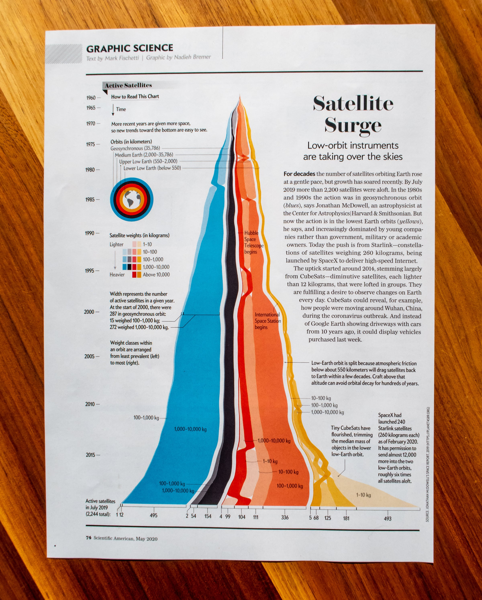

# STAT 679 / 992: Statistical Data Visualization

## Fall 2022

```{r setup, include=FALSE}
library(tidyverse)
library(knitr)
opts_chunk$set(
  echo = TRUE,
  message = FALSE,
  warning = FALSE,
  cache = TRUE,
  dpi = 200,
  fig.align = "center",
  out.width = 650,
  fig.height = 3,
  fig.width = 9
  )
th <- theme_minimal() +
  theme(
    panel.grid.minor = element_blank(),
    panel.background = element_rect(fill = "#f7f7f7"),
    panel.border = element_rect(fill = NA, color = "#0c0c0c", size = 0.6),
    axis.text = element_text(size = 14),
    axis.title = element_text(size = 16),
    legend.position = "bottom"
  )
theme_set(th)
options(width = 100)
```

---

# September 7, 2022

1. [Review syllabus](https://canvas.wisc.edu/courses/321152/files/27081478?module_item_id=5152442)
1. Review class resources
1. [In-Class Exercise 0.1](https://canvas.wisc.edu/courses/321152/assignments/1623480?module_item_id=5162096)

---

### Welcome!!

I'm excited to share this course with you this semester. There are few
activities that engage creative, quantitative, and critical thinking skills all
at once, but data visualization is one of them.

Nothing makes my day like a good data visualization, and I look forward to
seeing those that you create.

---

### Syllabus

* Learning outcomes
* Teaching team and office hours
* Assessments
* Grading

---

### Learning Outcomes

In this class, you will learn to...

1. Draw from a **catalog of visual encodings** to support specific visual comparisons in temporal, geospatial, network, hierarchical, high-dimensional count, text, and uncertain data and demonstrate facility implementing them using the R and javascript programming languages.
2.	Draw from a **catalog of interactivity patterns** to compose visualizations that
respond to user’s dynamic queries.
3.	Using the vocabulary of data visualization, **analyze and critique visual designs**.

---

### Learning Outcomes

In this class, you will learn to...

4.	Given a data analysis problem and initial design solution, iteratively **refine visual encodings and interactivity** idioms from across the design space until a satisfactory solution is discovered.
5.	**Navigate the data visualization research literature**, summarize the contributions of a specific methodological proposal, and evaluate their applicability in specific problem contexts.

---

### Office Hours

.pull-left[
We will announce in-person and virtual office hours depending on the results of
this poll: https://tinyurl.com/8wf4utsp
]

.pull-right[
```{r, out.width = 400, echo = FALSE}

```
]

---

### Office Hours

.pull-left[
We will announce in-person and virtual office hours depending on the results of
this poll: https://tinyurl.com/8wf4utsp
]

.pull-right[
```{r, out.width = 690, echo = FALSE}
include_graphics("figures/20210607_132612.jpg")
```
]

---

### Assessments

* In-class exercises and discussions (graded {0, 50, 100%})
* 4 problem sets 
* 3 group project reports and 1 presentation
  - Teams of 4 - 5 people
* 1 midterm exam

---

### Grading

* Problem Sets: 35%
* Group Project: 25%
* In-Class Exercises: 20%
* Midterm: 20%

---

### Canvas Page Walkthrough

```{r, echo = FALSE}
include_graphics("figures/canvas.png")
```


---

### Class Resources

1. [Canvas page](https://canvas.wisc.edu/courses/321152)
  - Links to all other resources
1. [Readings](https://drive.google.com/file/d/16jr5MlX8axfDVZ3kS4vZuWzqDOpj1Wng/view?usp=sharing)
1. [Piazza](https://piazza.com/wisc/fall2022/stat679f22/home)
1. [Exercises](https://canvas.wisc.edu/courses/321152/files/27094119?module_item_id=5161970)
1. [Online notes](https://krisrs1128.github.io/stat679_notes/)
1. [Online recordings](https://mediaspace.wisconsin.edu/) (also linked in notes)
1. [Worked code examples](https://github.com/krisrs1128/stat679_code) (also linked in notes)

---

### Questions?

Also feel free to speak with me after class.

---

### Exercise 0.1

1. Introduce yourself to the people sitting at your table. Your name, program,
and one thing most people don't know about you.

1. Submit a response to [Formulating Questions] in the exercise sheet.

1. Share your chosen datasets in groups of 2 - 3 people.

[Formulating Questions] Pick a dataset from
[TidyTuesday](https://github.com/rfordatascience/tidytuesday#datasets), [Data Is
Plural](https://docs.google.com/spreadsheets/d/1wZhPLMCHKJvwOkP4juclhjFgqIY8fQFMemwKL2c64vk/edit#gid=0),
[Kaggle Datasets](https://www.kaggle.com/datasets), [Google Dataset
Search](https://datasetsearch.research.google.com/), or your own personal
studies that you would like to visualize this semester. What makes you
interested in this dataset? Please provide a link, so we can use it to create
future exercises.

---

# September 12, 2022

1. Exercise review
1. Code demo [City Temperatures]
1. In-Class Exercise 1.1

---

### Announcements

1. Office hours will be held 2 - 3pm Tuesdays and 11am - 12pm on Fridays. These
sessions will be hybrid -- you can join in person at MSC 7225C or through Zoom.

1. The description for how to form groups is in Project Milestone 0. If you do
not form a team by the deadline, you will be randomly assigned one.

1. Problem set 1 is online.
---

### Exercise Review

* Let's analyze the exercise results together
* I've uploaded a starter document here: https://tinyurl.com/37vn2ywb
* It also includes the exercise we'll work on together afterwards

---

### Exercise 1.1

The data below measures properties of various Antarctic penguins.

```{r, echo = TRUE}
penguins <- read_csv("https://uwmadison.box.com/shared/static/ijh7iipc9ect1jf0z8qa2n3j7dgem1gh.csv")
```

Create a single plot that makes it easy to answer both of these questions,
(i) How is bill length related to bill depth within and across species? (ii)
On which islands are which species found?

Read about [Simpson's
paradox](https://en.wikipedia.org/wiki/Simpson%27s_paradox) and summarize it
in your own words. Then, explain how part (i) provides a real-world example
of this paradox.

If you finish early -- can you think of an alternative encoding that
visualizes the same information? How do the encodings compare and contrast
with one another?

---

# September 14, 2022

1. Exercise review
1. Code demo [Plant growth]
1. (If Time) Discussion [When2meet]
1. [In-Class Exercise 1.2]

---

### Exercise Review

This is an exercise in compactly encoding a mix of continuous (bill length and
depth) and nominal (species and island) variables. There are several approaches
possible, and there are trade-offs between them,

  * Color and shape: It's convenient to place all data into the same space, but
  shapes can be hard to read.
  * Color combinations: It's easier to distinguish colors than shapes, but requires
  continually looking up which color is which combination.
  * Faceting: Easier to compare combination, but each panel gets less space.
  
---

### Exercise Review

```{r, fig.width = 6, fig.height = 4, out.width = 600}
ggplot(penguins) +
  geom_point(aes(bill_length_mm, bill_depth_mm, col = species, shape = island))
```

---

```{r, fig.width = 6, fig.height = 4, out.width = 550}
ggplot(penguins) +
  geom_point(aes(bill_length_mm, bill_depth_mm, col = species, shape = island)) +
  scale_color_brewer(palette = "Set2") +
  scale_shape_manual(values = c(16, 0, 8)) +
  labs(
    x = "Bill Depth",
    y = "Bill Length"
  )
```
---

```{r, fig.width = 6, fig.height = 4, out.width = 550}
ggplot(penguins) +
  geom_point(aes(bill_length_mm, bill_depth_mm, col = interaction(species, island))) +
  scale_color_brewer(palette = "Set2") +
  theme(strip.text = element_text(size = 18)) +
  labs(
    x = "Bill Depth",
    y = "Bill Length"
  )
```

---

### Exercise Review

```{r, fig.width = 12, fig.height = 4, out.width = 1000}
ggplot(penguins) +
  geom_point(aes(bill_length_mm, bill_depth_mm, col = species)) +
  facet_wrap(~ island)
```

---

### Exercise Review

```{r, fig.width = 12, fig.height = 4, out.width = 800}
ggplot(penguins) +
  geom_point(aes(bill_length_mm, bill_depth_mm, col = species)) +
  facet_wrap(~ island) +
  scale_color_brewer(palette = "Set2") +
  theme(strip.text = element_text(size = 18)) +
  labs(
    x = "Bill Depth",
    y = "Bill Length"
  )
```

---

### Exercise Review

```{r, fig.width = 6, fig.height = 4, out.width = 320}
ggplot(penguins, aes(bill_length_mm, bill_depth_mm)) +
  geom_point(aes(col = species, shape = island)) +
  stat_smooth(aes(col = species), method = "lm", se = FALSE) +
  stat_smooth(method = "lm", se = FALSE, col = "#0c0c0c") +
  scale_color_brewer(palette = "Set2") +
  scale_shape_manual(values = c(16, 0, 8)) +
  theme(strip.text = element_text(size = 18)) +
  labs(
    x = "Bill Depth",
    y = "Bill Length"
  )
```

---

### Exercise Review

```{r}
ggplot(penguins, aes(bill_length_mm, bill_depth_mm)) +
  geom_point(aes(col = species)) +
  stat_smooth(aes(col = species), method = "lm", se = FALSE) +
  stat_smooth(method = "lm", se = FALSE, col = "#0c0c0c") +
  facet_wrap(~ island) +
  scale_color_brewer(palette = "Set2") +
  theme(strip.text = element_text(size = 18)) +
  labs(
    x = "Bill Depth",
    y = "Bill Length"
  )
```

---

### Discussion [When2Meet]

* With your neighbors, work through (a - c) of [When2Meet] on the exercise
sheet
* I will ask groups to share brief a summary of their discussions with the rest
of the class
* The question is included on the next slide

---

In addition to being a scheduling tool, When2Meet polls provide a heatmap
visualization of respondent availability. In this exercise, use the results from
our [office hour poll](https://www.when2meet.com/?16334941-sIMyb) to evaluate
the properties of this visualization.

  a. What are two concrete questions that the heatmap visualization is
  effective at answering? Why do you think this?
  
  b. What are two concrete questions that the heatmap visualization is *not* 
  effective at answering? Why do you think this?
  
  c. Describe an alternative static or interactive visual design that is
  better suited to one of the questions you identified in (b).
  
  d. The dataset at [this link](https://raw.githubusercontent.com/krisrs1128/stat679_code/main/examples/week1/when2meet_679f22.csv) include responses from our poll. Columns 1 - 35 represent students, and 1/0
  denotes whether the student is or is not available. Implement a version of
  your proposed visual design from (c).

---


### Code Demo [Plant Growth]

* This is a problem in reshaping data to support visualization.

* I've uploaded a starter document here: https://tinyurl.com/5dzsx9ey

---

### Exercise 1.2

20 minutes: In teams of 2 - 5 people, work through [Concept Map] in the exercise
sheet.

10 minutes: Share your concept map with a neighboring team. First, present your
diagram -- you should recap the main points from the course in your own words.
Then, compare and contrast the ways in which your groups organized or
prioritized information.

Note: You will have to form a team on the "People" page on Canvas. Have one
person from your team submit a photo of your concept map and summarize the main
points from your discussion.

---

### Exercise 1.2 [Concept Map]

Prepare a concept map to summarize the last week of reading material. An
effective submission will include a thorough coverage of both abstract concepts
and practical examples, summarized concisely into short phrases. It will also
include well-justified links between nodes, with text explanations for edges
whose interpretation might not be obvious at first.

---

# September 19, 2022

1. Exercise review
1. Code demo [Improving an App]
1. [In-Class Exercise 2.1]

---

### Announcements

* Project Milestone 0 (Forming Groups) is due on Friday.

---

### Exercise Review

A few common themes emerged across most submissions,

* The distinctions between data, geometry, and encoding in ggplot2
* Descriptions of what make an encoding / visualization effective
  - Clear comparisons, overall readability, orientation around specific tasks
* Description of the different ggplot2 geometry layers
* Examples of faceting and when it can be helpful

---

### Optional: Share your concept map

* I created a Piazza note where you can share your concept map with others in the
class
* Even though the content is similar across submissions, the ways of organizing
information could be quite different
  - If there is a style you like, it can be a nice exercise to try imitating it
  in a future concept map

---

### In-Class Demo [Improving an App]

* This exercise uses reactive expressions to make messy (but still functional)
Shiny apps more readable

* I've uploaded a starter document here: https://tinyurl.com/mw35y9ve

---

### Exercise 2.1

[Olympics Interactive App] 
 
 Hints:
 
   *  For part (a), a `renderPlot()` server element needs to be rerun each time
   the sports `selectInput` has been changed.
   * For part (b), consider how we shared filtered data across server elements
   in the penguin example today.
 
 
---

### September 21, 2022

1. Exercise review
1. Code demo [California Wildfires]
1. [In-Class Exercise 2.2]

---

### Announcements

1. For the exercises, know that there is already an Rmarkdown document that
includes all problem descriptions. You don't need to copy and paste code from
PDFs.

---

### Exercise Review

**Part (a)**: The following server code creates a "selected" column specifying
whether the athlete competes in one of the selected sports.

```{r}
server <- function(input, output) {
  current_data <- reactive({
    olympics %>%
      mutate(selected = Sports %in% input$dropdown)
  })
  
  output$scatterplot <- scatterplot(current_data())
}
```

---

### Exercise Review

<iframe src="https://data-viz.it.wisc.edu/content/5c919ba9-52e0-4f3a-ba35-47a58eed16fd" width=800 height=500/>

---

### Exercise Review

**Part (b)**: We can introduce a `dataTableOutput` to print the selected athletes.

```{r, eval = FALSE}
ui <- fluidPage(
  selectInput("dropdown", "Select a Sport", choices = unique(olympics$Sport), multiple = TRUE),
  plotOutput("scatterplot"),
  dataTableOutput("table")
)
    
```

---

### Exercise Review

We can use the same reactive as before to populate the table.

```{r}
server <- function(input, output) {
  updated <- reactive({
    olympics %>%
      mutate(selected = Sport %in% input$dropdown)
  })
  
  output$scatterplot <- renderPlot(scatterplot(updated()))
  output$table <- renderDataTable(
    updated %>% filter(selected)
  )
}
```

---

### Exercise Review

<iframe src="https://data-viz.it.wisc.edu/content/04140b59-14cd-4c04-91b2-a0c64e6ee29c" width=800 height=500/>

---

### Exercise Review

.pull-left[
* This is also our first visualization implementing something like a "Focus +
Context Principle." 
* We're able to zoom into a few elements of interest without
losing the overall context.
]

.pull-right[
<iframe src="https://player.vimeo.com/video/363453522?h=ea9887b2e6" width="610" height="330" frameborder="0" allow="autoplay; fullscreen; picture-in-picture" allowfullscreen></iframe>
<p><a href="https://vimeo.com/363453522">[VIS19 Preview] Periphery Plots for Contextualizing Heterogeneous Time-Based Charts (short paper)</a></p>
]

---

### Code Demo

* This exercise will give some more practice with Shiny visualization. We'll
look at a dataset of California Wildfires between 2013 and 2019.

* I've uploaded a starter document here: https://tinyurl.com/2p9dpux2

---

### In-Class Exercise

In teams of 2 - 4 people, work through [Reactivity Graphs] in the exercise
sheet.

For submission, have one member of your team submit a short video of the
original interactive visualization and a sketch of the reactive graph you
derived from it. Work in the same teams that you used to submit exercise 1.2.

Additionally:  Identify one point of common confusion across your group. Include this in
  your write-up so that we can go over the most common ones during lecture on
  Monday.

---

### September 26, 2022

1. Exercise review
1. Code demo [Wildfires - Part (c)]
1. [In-Class Exercise 3.1]

---

### Announcements

1. Issue with group submission for Exercise 2.2 - we will manage it
1. Problem Set 1 is due on Friday (9/30) at 11:59pm
1. Thank you to the students who helped fix the `quantile` input in the in-class
demo. Their approach is in the In-Class Demo 2.2 link.

---

### Shiny Apps in Problem Sets

If you tried compiling a Shiny app within an rmarkdown document, you probably
saw a message like the one below,


You did not make a mistake! Shiny doesn't allow you to host an app within an
Rmarkdown document, unfortunately.

---

### Shiny Apps in Problem Sets

To let us grade your Shiny apps within the problem sets, you have three options,

1. Release the code in a way that allows us to run it (for example, make sure
you don't refer to any file paths on your computer). Upload both your compiled
document and the original `.Rmd` source.

1. Include a screen recording of your app along with the code you used to create
it. If you do this, you do not need to make sure other computers can run your
code -- we will just read it.

1. You could try hosting your app on a public site. UW Madison has an Rstudio
Connect account, which lets you host apps for free. You can sign up
[here](https://it.wisc.edu/news/rstudio-team-pilot/).

---

### Points of Confusion

1. Where do events (e.g., button clicks) go in the reactive graph?
1. What is the difference between a reactive expression and a function?
1. Subtleties between outputs we didn't cover in class -- `eventReactive()` and `observeEvent`

---

### Points of Confusion

Q: Where do events (e.g., button clicks) go in the reactive graph?

These kinds of events actually live "outside" the reactive graph. There is a
chapter about this in the [Mastering Shiny
book](https://mastering-shiny.org/reactivity-components.html). Don't worry if
you created a node for this -- we hadn't covered this in class.


---

### Points of Confusion

Q: Where do events (e.g., button clicks) go in the reactive graph?

Here is an example from the book,

```{r, eval = FALSE}
ui <- fluidPage(
  textInput("nm", "name"),
  actionButton("clr", "Clear"),
  textOutput("hi")
)
server <- function(input, output) {
  hi <- reactive(paste0("Hi ", input$nm))
  output$hi <- renderText(hi())
  observeEvent(input$clr, {
    updateTextInput(inputId = "nm", value = "")
  })
}

shinyApp(ui, server)
```

---

### Points of Confusion

Q: Where do events (e.g., button clicks) go in the reactive graph?


---

### Points of Confusion  

Q: What is the difference between a reactive expression and a function?

1. A reactive expression is like a function that can depend on `input` elements,
and which reruns each time an input is changed
1. Using a function within a server, but outside of a `render` or `reactive`
context, will fail


```{r, eval = FALSE}
f <- function(x) {
  x ^ 2
}

## DOES NOT WORK
server <- function(input, output) {
  f(input$x)
  ...
}
```

---

### Points of Confusion

Q: Subtleties between outputs we didn't cover in class -- `eventReactive()` and
`observeEvent()`

An observer does not store any value. An `eventReactive()` can store an
intermediate value that appears in a later `render*` expression.

---


### In-Class Demo

* This exercise uses extends our earlier wildfires app to use graphical inputs

* I've uploaded a starter document here: https://tinyurl.com/nhb6kt46

---

### In-Class Demo

Right now, the dotplot responds to the brushed histogram. However,

  * The dotplot does not allow any user inputs.
  * The histogram does not reflect year or user selections.

Imagine someone came to your statistical consulting hours with this application.
They want your expertise to improve the app so that it conveys more information.
How would you approach this? What might be some first steps towards
implementation?

Take 7 minutes to discuss with a neighbor, then we will regroup and share.

---

### In-Class Exercise

[Birds Brushed Scatterplot] - Only part (a)

Hint: This problem is similar to the example in Week 3 - 2: Brush Inputs.

---

### September 28, 2022

1. Exercise review
1. Project Strategies + Q&A
1. [In-Class Exercise 3.2]

---

### Announcements

1. This Friday's Office Hours rescheduled to 2 - 3pm (not 11am - 12pm).
1. We will be moving on to Module 2 (Visualization with D3) starting
next week. If you have questions about ggplot2 or shiny visualization, it is
best to reach out soon.

---

### Exercise Review

This is an exercise in using `reactiveVal` and `observeEvent` to support a brush
query within Shiny.

```{r, eval = FALSE}
library(shiny)
ui <- fluidPage(
  fluidRow(
    column(6, plotOutput("plot", brush = "plot_brush")),
    column(4, dataTableOutput("table"))
  )
)
```

---

### Exercise Review

The server uses a `reactiveVal` + `observeEvent` pattern.

```{r, eval = FALSE}
server <- function(input, output) {
  selected <- reactiveVal(rep(TRUE, nrow(birds)))
  observeEvent(
    input$plot_brush,
    selected(brushedPoints(birds, input$plot_brush, allRows = TRUE)$selected_)
  )

  output$plot <- renderPlot(scatter(birds, selected()))
  output$table <- renderDataTable(
    filtered_table(birds, selected()),
    options = list(pageLength = 5)
  )
}
```

---

### Exercise Review

These functions update the table and scatterplot based on the selection.

```{r}
scatter <- function(x, selected_) {
  x %>%
    mutate(selected_ = factor(selected_, levels = c("FALSE", "TRUE"))) %>%
    ggplot() +
    geom_point(aes(Ellipticity, Asymmetry, col = selected_)) +
    scale_color_manual(values = c("black", "red")) +
    theme(legend.position = "none")
}

filtered_table <- function(birds, selected_) {
  birds %>% 
    select(Order, Family, MVZDatabase) %>% 
    filter(selected_)
}
```

---

<iframe src="https://data-viz.it.wisc.edu/content/0592d810-d75c-43f4-8d27-817e1276ac8c" width = 900 height = 500/>

---

### Project Reflections

1. How should you approach your course project?
1. Hopefully, these reflections will be useful for your future projects too
1. Please ask questions, this will work better as a discussion

---

### Conceptualization: Storytelling

The most compelling projects are structured like stories.

Opening: What is the setting? Who are the main characters?

Conflict: How is the state of the world unsatisfactory?

Action: How was the conflict resolved?

Resolution: What have we learned more generally?

---

### Conceptualization: Community

1. In the area that you choose to study, who are your intellectual peers?
1. A common problem in data science projects are that they become too abstract /
have no clear intended audience.
1. The project should be interesting because of what it says about real world
phenomena which are interseting within your community -- don't talk about data
without context.

---

### Conceptualization: Synthesis

1. No problems are solved in a vacuum. What ideas are you building from?
1. The most creative projects draw from sources that were not obviously
relevant, but which later turn out to be.

---

### Implementation: Reading

1. For both community and synthesis, it is very helpful to read extensively
1. This helps you understand the standards of the community (or communities) you
are working in.
1. It also provides source material for problem solving.
1. Today's in-class exercise provides more concrete suggestions for how to go
about identifying reading material

---

### Implementation: Prototyping

1. It is much better to explore a variety of designs before committing to one
specific approach.
1. This is one of the reasons why having a well-defined problem is important --
it creates a center around which many approaches can be explored

.center[

]

---

### Implementation: Feedback

1. Some of the most important data you can get during a project is feedback from
your peers
1. Their responses may reveal unwarranted assumptions you have made or point you
towards a previously unnoticed path forward

---

### Reflection and Questions

With your project group, take 5 minutes to brainstorm a list of conceptual or
logistical questions you have related to the project. We will discuss these as a
group.

---

### Exercise 3.2

With your project team, work through [Guided Literature Search] in the exercises
sheet.

---

### October 3, 2022

1. Intro to D3 / Workflow Setup
1. In-Class Demo 4.1
1. In-Class Exercise 4.1

---

### Announcements

1. Solutions to Problem Set 1 will be posted Wednesday (after the final deadline
for late assignments). Consider reviewing even if you understood exercises --
you might find alternative solutions or ways to improve the presentation of your
submission.
1. Problem Set 2 will be online before class Wednesday (Due 10/21)
1. Nate Silver (from FiveThirtyEight) is giving a free, public talk on October 26. [Tickets go on sale today](https://lafollette.wisc.edu/event/nate-silver/).

---

### Introduction to D3

1. D3 is a visualization library written in javascript.
1. It operates at a much lower level than R / ggplot2. This both makes it much
more flexible, but also requires more effort to work with.
1. Unlike Shiny, it can modify visualizations in place, since it doesn't depend
on transitions between static image views.

---

.pull-left[
An example D3 visualization from Nadieh Bremer's [portfolio](https://www.visualcinnamon.com/portfolio/sciam-satellite-surge/).
]



---

Smooth transitions in a barchart, from the D3 collection on [Observable](https://observablehq.com/@d3/bar-chart-transitions).

<iframe width="100%" height="550"
  src="https://observablehq.com/embed/@d3/sortable-bar-chart?cell=viewof+order&cell=chart"></iframe>

---

A D3-based
[animation](https://observablehq.com/@mbostock/connected-particles-iii) written
by the original developer of D3, Mike Bostock.

<iframe width="100%" height="550" frameborder="0"
  src="https://observablehq.com/embed/@mbostock/connected-particles-iii?cells=canvas%2Cn%2Cheight%2Cradius"></iframe>

---

### Workflow Setup

1. To build D3 visualizations, we will mainly be editing `.html`, `.css`, and
`.js` files. This can be done in Rstudio, but other text editors work as well
(e.g., VSCode, Atom, Emacs, ...).
1. You will not need it this week, but starting next week, you will need to have
a python installation on your computer. This will be used to start a server
needed for loading data.
1. It's possible to incorporate D3 visualizations into Rmarkdown reports and
Shiny Apps. It is a somewhat more advanced topic, though, so reach out if you
would like to try this.

---

### Workflow Setup

Let's test our setup by editing a simple [HTML
file](https://github.com/krisrs1128/stat679_code/raw/main/examples/week4/week4-1/example_headings.html).
Work with your neighbors in case you have any difficulty.

```{html}
<!DOCTYPE html>
<html>
  <head>
  </head>
  <body>
    <h1>This is a Header</h1>
    <p>This text is in a paragraph</p>
  </body>
</html>
```

---

### Workflow Setup

1. Let's make sure you can add a `.js` file to do some computation in the
background.
1. You'll also want to be able to use your browser's developer tools. 

.pull-left[
`example_headings.html`
```{html}
<!DOCTYPE html>
<html>
  <head>
  </head>
  <body>
    <h1>This is a Header</h1>
    <p>This text is in a paragraph</p>
  </body>
  <script src="example.js"></script>
</html>
```
]

.pull-right[
`example.js`
```{js}
let x = [1, 2, 3];
console.log(x);
```
]

---

### Code Demo 4.1 [Draw a Smiley Face]

* This is an exercise in manipulating SVGs to draw a custom shape.

* I've uploaded a starter document here: https://tinyurl.com/7b5vr4xn

---

### In-Class Exercise 4.1 [Penguins Array Manipulation a - c]

[Penguins Array Manipulation] - Only parts (a, b, c)

* When you write your solution, you can still use `.Rmd` documents, but set
`eval = FALSE` in any `js` code blocks so that Rstudio doesn't try to compile
the code. Alternatively, you can submit a Word document or an Observable
Notebook.
* Hint: For part (b), refer to the example in Notes 4 - 2. For part (c), a one
line solution is possible using `map()`.

---

### October 5, 2022

1. Exercise review 4.1
1. In-Class Demo 4.2
1. Discussion
1. In-Class Exercise 4.2

---

### Announcements

1. Problem set 1 solutions are online, and problem set 2 is posted.
1. I will clap three times when I need the discussions to end / attention to
return to lecture.

---

### Exercise Review

For each of `penguins` and `penguins2`, describe whether the data structure is
(i) an object of arrays, (ii) an array of objects, or (iii) neither. In case
(iii), specify the structure.

* `penguins` is an array of objects. Each object corresponds to one row
(sample), and the array gives the full dataset.

```{r, eval = FALSE}
let penguins = [{"species":"Adelie","island":"Torgersen",...},{"species":"Adelie","island":"Torgersen",...}, ...]
```

---

### Exercise Review

For each of `penguins` and `penguins2`, describe whether the data structure is
(i) an object of arrays, (ii) an array of objects, or (iii) neither. In case
(iii), specify the structure.

* `penguins2` is an object of arrays. Each key of the object corresponds to one
column, and the associated array gives all penguins' measurements for that
column.

```{r, eval = FALSE}
let penguins2 = {"species":["Adelie","Adelie",...],"island":["Torgersen","Torgersen",...],...}
```


---

### Exercise Review

Using `penguins2`, compute the mean flipper length.

For this part, we need to (i) extract the array within the object containing flipper length, and (ii) compute its mean.

```{r eval = FALSE}
d3.mean(penguins2["flipper_length_mm"])
```

---

### Exercise Review

Using `penguins`, define a new array whose elements are `true` or `false`
depending on whether flipper length is larger than 187.

We can accomplish this using a for loop.

```{r, eval = FALSE}
let result = [];
for (let i = 0; i < penguins.length; i++) {
  result.push(penguins[i].flipper_length_mm > 187)
}
```

---

### Exercise Review

Using `penguins`, define a new array whose elements are `true` or `false`
depending on whether flipper length is larger than 187.

An even more concise solution uses `map`.

```{r, eval = FALSE}
result = penguins.map(d => d.flipper_length_mm > 187)
```

---

### Exercise Review

* This is how the solution looks like in a single javascript file
* For in-class exercises like this, it is enough to submit your HTML, CSS, and
JS files. Any discussion can go in JS comments or HTML paragraphs.

---

### In-Class Demo [4.2]

* We will work through [Modifying Selections] together

* I've uploaded a starter document here: https://tinyurl.com/4sampdzj

---

### Discussion

With others at your table, discuss any (or all) of the following prompts for
6 - 8 minutes.

* What originally motivated you to learn data visualization?
* Which of your personal values are reflected in your visualization interests?
* How might learning javascript or D3 relate to these original motivations / values?

---

### In-Class Exercise [4.2]

* Work through [Debugging JS Code] parts (b - d) in the exercises sheet. Discuss
with your team, but submit individually.
