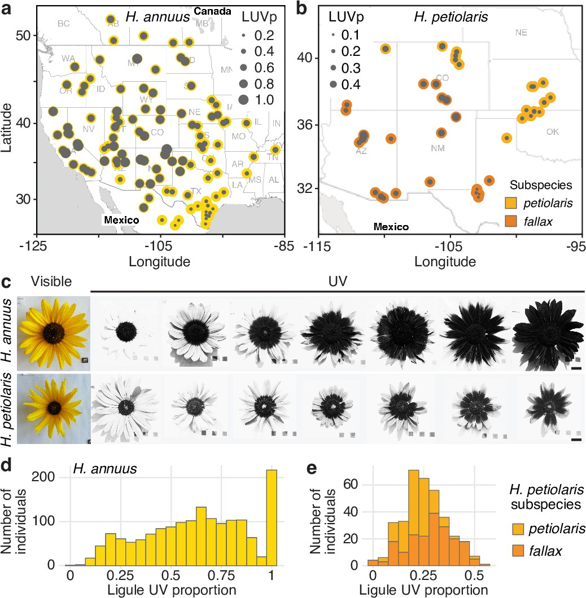

```{r, echo = FALSE, message = FALSE, warning = FALSE}
library(knitr)
library(tidyverse)
opts_chunk$set(cache = TRUE, message = FALSE, warning = FALSE, echo = TRUE, include = TRUE)
```

# Design Principles

1. [Formulating Questions] Pick a dataset from
[TidyTuesday](https://github.com/rfordatascience/tidytuesday#datasets), [Data Is
Plural](https://docs.google.com/spreadsheets/d/1wZhPLMCHKJvwOkP4juclhjFgqIY8fQFMemwKL2c64vk/edit#gid=0),
[Kaggle Datasets](https://www.kaggle.com/datasets), [Google Dataset
Search](https://datasetsearch.research.google.com/), or your own personal
studies that you would like to visualize this semester. What makes you
interested in this dataset? Please provide a link, so we can use it to create
future exercises.

1. [Data Types] For the following parts, specify whether the data field is
Nominal, Ordinal, or Quantitative.
    a. `BuildingArea` in the Melbourne Homes [dataset](https://uwmadison.box.com/shared/static/h5u176syp4xkret4w89n70efsp1tubex.csv)
    b. `Sport` in the 2012 Olympics [dataset](https://uwmadison.box.com/shared/static/rzw8h2x6dp5693gdbpgxaf2koqijo12l.csv)
    c. `age_group` in the Language Learning [dataset](https://uwmadison.box.com/shared/static/m53dea9w5ipczs3d7nqdnxqxx5ao501b.csv)

1. [Critique - Infographic] Figure 1 below is from the Information is Beautiful Infographic "Food Waste
is a Big Climate Problem We Can Actually Solve." It shows the breakdown of
sources of food waste in the UK. Give an example of a question that this
visualization helps answer. How easy / difficult is it to answer based on the
current design? What is one design choice that you like? What is one thing you
would do differently if you were redesigning it?
    
    ```{r fig.cap = "Sources of food waste, from Information is Beautiful infographic.", out.width = 250, fig.align = "center", echo = FALSE}
    include_graphics("figure/info-food-waste.png")
    ```
  
1. [Critique - Science Paper] Figure 2 below is from the scientific article *Both consumptive and non-consumptive effects of predators impact mosquito populations and have implications for disease transmission* by Russell et al. (2022). It describes the predators of mosquitos at different points in their life cycles. Give an example of a question that this visualization helps answer. How
easy / difficult is it to answer based on the current design? What is one design
choice that you like? What is one thing you would do differently if you were
redesigning it?
    
    ```{r, fig.cap = "Animals that eat mosquitos, depending on the age of the mosquito, from Russell et al. (2022).", out.width = 250, fig.align = "center", echo = FALSE}
    
    ```
  
1. [Critique - Science Paper] Figure 3 below is from the scientific article *Genetic basis and dual adaptive role of floral pigmentation in sunflowers* by Todesco et al. (2022).
While all sunflower petals look the same to us (they look yellow), they actually
vary quite a bit in how they reflect ultraviolet light, which is visible to
pollinators. The figure studies the variation in this ultraviolet proportion
(LUVp) across populations of sunflowers. Give an example of a question that this visualization helps answer. How
easy / difficult is it to answer based on the current design? What is one design
choice that you like? What is one thing you would do differently if you were
redesigning it?
    
    ```{r fig.cap = "Variation in amount of ultraviolet proportion of sunflower petals, from Todesco et al. (2022).", out.width = 250, fig.align = "center", echo = FALSE}
    
    ```
    
1. [`ggplot2` reflection] Compare and contrast the `ggplot2` package with an
alternative interface for constructing visualizations with which you have past
experience (e.g., base R’s `plot`, the `lattice` package, `matplotlib` in
python, Tableau, or Excel). What characteristics are common between the two
interfaces, and what is unique to each? In which situations does it make more
sense to use one approach vs. the other?

1. [Beauty and functionality] There are a surprising number of controversies in
data visualization, but few can get as heated as the beautify vs. functionality
debate. In each pair of articles below, we have one representative from each
school of thinking.
    
  	- [The Creative Pace of the 20th Century’s Greatest Authors, Visualized](https://www.themarginalian.org/2013/11/29/accurat-modern-library/) vs. [Redesigning Visualizations](http://www.thefunctionalart.com/2014/11/redesigning-visualizations.html)
  	- [Poor op/ed data graphic in New York Times](https://www.edwardtufte.com/bboard/q-and-a-fetch-msg?msg\_id=0000gG) vs. [The Power of Visualization’s “Aha!” Moments](https://hbr.org/2013/03/power-of-visualizations-aha-moment)
  
    Respond to the positions taken by one of these pairs of articles (you are free
    to choose). Which of the arguments did you find most / least convincing? How
    might you evaluate the beauty or functionality of your own visualizations?

1. [Reading Response] This problem asks you to reflect on one of the 
readings from this week. Prepare a brief (1 paragraph)
response. For example, you may discuss any of the following points,
    
    a. Are there points from the reading that you strongly agree or disagree with?
    b. Are there lessons from the reading that you think you might incorporate into
    your future projects or plans?
    c. How would you explain the main ideas of the reading to a friend who is not
    technically trained in visualization?
  
1. [Visual Redesign] In this exercise, you will find a visualization you have
made in the past and redesign it using the skills you have learned in this
course.

  	a. Identify one of your past visualizations for which you still have data.
  	Include a screenshot of this past visualization.
	  b. Comment on the main takeaways from the visualization and the graphical
	  relationships that lead to that conclusion. Is this takeaway consistent with
	  the intended message? Are there important comparisons that you would like to
	  highlight, but which are harder to make in the current design?
  	c. Comment on the legibility of the original visualization. Are there aspects
  	of the visualization that are cluttered or difficult to read?
  	d. Propose and implement an alternative design. What visual tasks do you
  	prioritize in the new design? Did you have to make any trade-offs? Did you
  	make any changes specifically to improve legibility.

1. [Concept Map] Prepare a concept map to summarize the last week of reading
material. An effective submission will include a thorough coverage of both
abstract concepts and practical examples, summarized concisely into short
phrases. It will also include well-justified links between nodes, with text
explanations for edges whose interpretation might not be obvious at first.

1. [Mini-presentation] Prepare a short presentation to summarize the last week
of reading material. Make sure to include coverage of both important concepts
and practical implementation details. Prepare either a short set of slides or an
original code notebook. When you present your material, make sure that all team
members have an opportunity to speak.

1. [New Data Application] Create a version of a visualization included in this
week’s readings, lecture notes, or in-class exercises, but applied to new
dataset of your choice.
	
  	a. Provide a reference to the visualization that you will be adapting for your application.
  	b. Identify a dataset that you will use. What makes this dataset interesting,
  	and how was it gathered / generated?
  	c. Generate a version of the visualization from (a) to the dataset from (b).
  	Interpret the result in context.

1. [Dissecting a visualization] Pick two static views of visualizations from any
of the following sites: 1, 2, 3. For each view, answer the questions below,

    a. What graphical marks are used in the display? What data attribute does
    each mark encode?
    b. Are there visual queries that their design makes especially
    straightforward to answer? Are there queries that are more difficult
    relative to a simpler alternative? 
    c. Why do you think the authors chose the visual encodings that they did?
  
# Visualization with R

1. [Ikea Furniture] The dataset below shows prices of pieces of Ikea furniture.
We will compare prices of different furniture categories and label the
(relatively few) articles which cannot be bought online.

    ```{r}
    ikea <- read_csv("https://uwmadison.box.com/shared/static/iat31h1wjg7abhd2889cput7k264bdzd.csv")
    ```
    a. Make a plot that shows the relationship between the `category` of furniture
and `price` (on a log-scale). Show each `item_id` as a point -- do not aggregate
to boxplots or ridgelines -- but make sure to jitter and adjust the size the
points to reduce the amount of overlap. _Hint: use the `geom_jitter` layer._
    b. Modify the plot in (a) so that categories are sorted from those with highest
to lowest average prices.
    c. Color points according to whether they can be purchased online. If they
cannot be purchased online, add a text label giving the name of that item of
furniture.

1. [City Temperatures] Let's create versions of Figure 2.3 and 2.4 from the
[reading](https://clauswilke.com/dataviz/aesthetic-mapping.html) this week. The
command below reads in the data. We've filtered to a slightly different set of
cities (Barrow is in Alaska, Honolulu is in Hawaii), but we should still be able
to study changes in temperature over time.

    ```{r}
    temperature <- read_csv("https://raw.githubusercontent.com/krisrs1128/stat479_s22/main/data/temperatures.csv")
    ```
    a. Make a version of Figure 2.3 using a line mark (`geom_line`). Make at
    least one customization of the theme to make the plot more similar to the
    version in Figure 2.3. _Hint: To group the lines by city, use the `group = ` aesthetic mapping._
    b. Using the `group_by` + `summarise` pattern, compute the mean temperature
    for each month in each city.
    c. Using the data generated in (b), Make a version of Figure 2.4 using a
    tile mark (`geom_tile`). Try either (i) adding the `scale_fill_viridis_c(option =
    "magma")` scale to match the color scheme from the reading or (ii) adding
    `coord_fixed()` to make sure the marks are squares, not rectangles.
    d. Compare and contrast the two displays. What types of comparisons are
    easier to make / what patterns are most readily visible using Figure 2.3 vs.
    Figure 2.4, and vice versa?
  
1. [Penguins] The data below measures properties of various Antarctic penguins.
    ```{r, echo = TRUE}
    penguins <- read_csv("https://uwmadison.box.com/shared/static/ijh7iipc9ect1jf0z8qa2n3j7dgem1gh.csv")
    ```
    Create a single plot that makes it easy to answer both of these questions, (i) How is bill length related to bill depth within and across species? (ii) On which islands are which species found?
    
    Read about [Simpson's paradox](https://en.wikipedia.org/wiki/Simpson%27s_paradox) and summarize it in your own words. Then, explain how part (i) provides a real-world example of this paradox.

1. [London Olympics] The data at this
[link](https://uwmadison.box.com/s/rzw8h2x6dp5693gdbpgxaf2koqijo12l) describes
all participants in the London 2012 Olympics.
    a. Create a layered display that shows (i) the ages of athletes across sports
    and (ii) the average age within each sport.
    b. Sort the sports from lowest to highest average age.
    c. Develop one new question based on these data. What makes you interested
    in it? Provide a visualization that supports the comparisons needed to
    arrive at an answer.
    
    ```{r}
    olympics <- read_csv("https://uwmadison.box.com/shared/static/rzw8h2x6dp5693gdbpgxaf2koqijo12l.csv")
    ```

1. [Language Learning] This problem will look at a simplified version of the 
data from the study _A critical period for second language acquisition: Evidence from 2/3 million English speakers_, 
which measured the effect of the the age of initial language learning on
performance in grammar quizzes. We have downloaded the data from the
supplementary material and reduced it down to the average and standard
deviations of test scores within (initial learning age, the `Eng_start`
variable) $\times$ (current age-group, the `age_group` variable) combinations.
We have kept a column `n` showing how many participants were used to compute the
associated statistics. The resulting data are available
[here](https://uwmadison.box.com/shared/static/m53dea9w5ipczs3d7nqdnxqxx5ao501b.csv).

    a. Define two new fields, `low` and `high`, giving confidence intervals for
    the means in each row. That is, derive new variables according to $\hat{x} \pm 2 * \frac{1}{\sqrt{n}}\hat{\sigma}$.
    
    b. Design and implement a visualization that helps answer the following
    questions,
    
      - How does test score vary as a function of current age group?
      
      - How does test score vary as a function of initial learning age? Is this
      relationship the same across all age groups?
  
      - For which populations are we least certain about true language learning
      ability?
    
    c. Provide answers for each question from (b) within context.
   
1. [Homelessness] Take a static screenshot from any of the visualizations in
this
[article](https://www.theguardian.com/us-news/ng-interactive/2017/dec/20/bussed-out-america-moves-homeless-people-country-study),
and deconstruct its associated visual encodings. 

    a. What do you think was the underlying data behind the current view? What where
    the rows, and what were the columns?
    b. What were the data types of each of the columns?
    c. What encodings were used? How are properties of marks on the page derived
    from the underlying abstract data?
    d. Is multi-view composition being used? If so, how?
  
1. [Plant Growth Experiment] This problem will give you practice with tidying a
dataset so that it can be easily visualized. The data describe the height of
several plants measured every 7 days. The plants have been treated with
different amounts of a growth stimulant. The first few rows are printed below --
`height.x` denotes the height of the plant on day `x`.
    
    ```{r}
    plants <- read_csv("https://uwmadison.box.com/shared/static/qg9gwk2ldjdtcmmmiropcunf34ddonya.csv")
    ```
    
    a. Propose an alternative arrangement of rows and columns that conforms to the
    tidy data principle.
    
    b. Implement your proposed arrangement from part (a).
    
    c. Using the dataset from (b), design and implement a visualization showing the
    growth of the plants over time according to different treatments.
    
1. [California Wildfires] In this problem, we will interactively visualize a
[dataset](https://uwmadison.box.com/shared/static/k5vvekf1bhh9e16qb9s66owygc70t7dm.csv)
giving statistics of recent California wildfires. The steps below guide you
through the process of building this visualization.
    
    a. (Static) Plot the day of the year that each fire started against the
    county within which it was located. Use the size of the mark to encode the
    number of acres burned in each fire.
    
    b. (Interactive) Provide a way for the viewer to interactively highlight or
    reveal details about subsets of fires. For example, introduce a slider to
    interactively highlight selected years, a tooltip to highlight the name of a
    fire, or a select to search for counties, or a slider to filter by fire
    size.
    
    c. Introduce at least one other UI output. For example, print a table of the
    selected fires, interactively print summary statistics, or show a histogram
    of fire sizes. Sketch the reactivity graph associated with your application.
    
1. [Pokemon]  This problem gives practice in deriving new variables to improve a
faceted plot. The data below give attack and defense statistics for Pokemon,
along with their types. We will build a visualization to answer the question --
how do the different types of Pokemon vary in their attack and defense
potential?

    ```{r}
    pokemon <- read_csv("https://uwmadison.box.com/shared/static/hf5cmx3ew3ch0v6t0c2x56838er1lt2c.csv")
    ```
        
    a. Derive a new column containing the attack-to-defense ratio, defined as
    $\frac{\text{Attack}}{\text{Defense}}$.
    
    b. For each `type_1` group of Pokemon, compute the median attack-to-defense
    ratio.
    
    c. Plot the attack vs. defense scores for each Pokemon, faceted by `type_1`. Use
    the result of (b) to ensure that the panels are sorted from types with highest
    to lowest attack-to-defense ratio.
    
    d. Propose, but do not implement, a visualization of this dataset that makes use
    of dynamic queries. What questions would the visualization answer? What would be
    the structure of interaction, and how would the display update when the user
    provides a cue?
    
1. [Melbourne Missingness] Consider the plot of missingness in the Melbourne Homes dataset in Figure 4. Select all the true conclusions.

    * The `Landsize` variable is always missing.
    * The variable with the highest number of missing values is `BuildingArea`. 
    * There are 560 rows where exactly one of `CouncilArea`, `YearBuilt`, or `BuildingArea` are missing.
    * In more than 2/3 of the rows where `BuildingArea` is missing, `YearBuilt` is also missing.
    
    ```{r, out.width = 400, fig.cap = "Upset plot of missingness in the Melbourne Homes dataset.", echo = FALSE}
    include_graphics("figure/melbourne_missigness.png")
    ```
    
1. Study the visualization at [this link](https://observablehq.com/@d3/collapsible-tree). Its design reflects which of the following visualization techniques? (select all that apply).
    * Faceting
    * Details-on-demand
    * Ridgelines
    * Overview + detail
    * Tidy data
    
1. [Yu-Gi-Oh!] This question asks you to tidy a Yi-Gi-Oh! [dataset](https://uwmadison.box.com/shared/static/asjb29rhu1hrm2zizv0iu7eqqw9mj0ds.csv).
    a. Write code that provides more meaningful attribute and type columns. The result of your transformation should look like [this](https://uwmadison.box.com/shared/static/6akcs5d1khcgxa4blgtcrylq8rl2dx9h.csv).
    b. Count the number of attribute and type combinations. Derive new features that count the fraction of each combination that are on the trading and official card game banlists (Banned trading and official cards have non-NA values in the tcg_ban and ocg_ban columns, respectively). The result of your transformation should look like [this](https://uwmadison.box.com/shared/static/frwm9uhqzx3rnjnh6j6vyt4ypvjwcb89.csv).
    c. Reshape the dataset so that the trading and official card game
    proportions are listed in a single column and the Spell and Trap cards are
    at the top. The result of your transformation should look like [this](https://uwmadison.box.com/shared/static/56mn6kfajqxua6tx4fgpq7r7ixs2zt0o.csv).

1. [Reshaping practice] The following parts ask you to provide R code that
transforms one dataset (I) into another (II).
    a. Regional murder rates: Turn [I](https://uwmadison.box.com/shared/static/h4gau9heqy3uue9rmpq9b55s3kw37zd8.csv) into [II](https://uwmadison.box.com/shared/static/h4gau9heqy3uue9rmpq9b55s3kw37zd8.csv). 
    b. Antiobitics and bacteria. Turn [I](https://uwmadison.box.com/shared/static/bq4afq9kl2zn9qlb89q2rxhrrv73iuil.csv) into [II](https://uwmadison.box.com/shared/static/gmzul7bp78o6kwtutl73hkiyxea4dr21.csv)

1. [Sales summaries] Consider the sales data below.
            
    ```{r, echo = FALSE}
    sales <- data.frame(
      region =  c('A', 'A', 'A', 'A', 'B', 'B', 'B', 'B'),
      quarter = c('Q1', 'Q2', 'Q3', 'Q4', 'Q1', 'Q2', 'Q3', 'Q4'),
      sales = c(6, 5, 3, 2, 4, 8, 2, 6)
    )
    sales
    ```
    
    a. Provide code to compute the total sales for each quarter, across both regions.
    The result should look like the table below.
      
    ```{r, echo = FALSE}
    sales %>%
      group_by(quarter) %>%
      summarise(total = sum(sales))
    ```
        
    b. Provide code to compute the proportion of each quarter's sales that came
    from each region. The result should look like the table below.
    
    ```{r, echo = FALSE}
    sales %>%
      group_by(quarter) %>%
      mutate(total = sum(sales)) %>%
      ungroup() %>%
      mutate(prop = sales / total) %>%
      select(-total)
    ```
    
1. [Interactive Penguins] This problem visualizes the Penguins [dataset](https://uwmadison.box.com/shared/static/ijh7iipc9ect1jf0z8qa2n3j7dgem1gh.csv) interactively.
    a. Create two static scatterplots: one of of bill length vs. depth and
    another of flipper length vs. body mass.
    b. Create selection menus that can be used to highlight the island that the
    penguin came from, along with its gender.
    c. Create selection brushes that can be used to link the two plots together.
    That is, highlighting points in a brush for one view should highlight the
    corresponding penguins in the other.
    d. Provide one takeaway from the interactive visualization that is not
    possible to make using the original static version.
    
1. [Olympics Derivations] This problem gives some practice with deriving and
visualizing new variables.

    a. Create new columns for the city and country of birth for each athlete in the
    London 2012 Olympics
    [dataset](https://uwmadison.box.com/s/rzw8h2x6dp5693gdbpgxaf2koqijo12l).
    b. Compute the standard deviation of athlete age within each sport. Which sport
    has widest SD in age?
    c. Make a visualization of sports against participant age. Sort sports by
    age variance.
    
    ```{r}
    olympics <- read_csv("https://uwmadison.box.com/shared/static/rzw8h2x6dp5693gdbpgxaf2koqijo12l.csv")
    ```
    
1. The following questions refer to the NYC flights dataset. The first few lines
are printed below.

    ```{r}
    library(nycflights13)
    flights %>% select(carrier, air_time, distance)
    ```
    
    a. Provide code to create a new column giving the average speed of
    the flight: $\texttt{speed} := \frac{\texttt{distance}}{\texttt{air\_time}}$.
    
    b. Is there a large variation in flight speed across carriers? Design
    and sketch code for a visualization that could be used to answer this
    question (you may assume the output of (a)).
    
    
1. [Birds Code Review] This exercise asks you to conduct an imaginary code
review. These are often used in data science teams to,
    
    * Catch potential bugs
    * Make sure code is transparent to others
    * Create a shared knowledge base
    
    It is important to be perceptive but friendly.
    
    * Can the code be made more compact?
    * Are there visual design choices / encodings that could be refined?
    * If your colleague did something well, say so!

    They can also be a great way to learn new functions and programming patterns.
    Unlike standard code-reviews, I ask you to give an example implementing your
    recommendations.
        
    Specifically, in this review, suppose you are working with a scientific
    colleague on your study of bird egg properties and their evolutionary
    implications. They have written the code below. Provide your code review as a
    set of bullet points, and include code giving an example implementation of your
    ideas. The original data are from [this study](https://www.science.org/doi/10.1126/science.aaj1945).
      
    ```{r, fig.cap = "An example figure for code review.", fig.height = 4, fig.width = 8}
    library(ggrepel)
    
    birds <- read_csv("https://raw.githubusercontent.com/krisrs1128/stat479_s22/main/exercises/data/birds.csv") %>%
      separate(Species, c("genus", "species2"))
    
    bird_summaries <- birds %>%
      group_by(genus) %>%
      summarise(across(c("Asymmetry", "Ellipticity", "AvgLength (cm)", "Number of images", "Number of eggs"), list(MEAN = mean, STANDARD_DEVIATION = sd))) %>%
      arrange(-Ellipticity_MEAN)
    
    ggplot(bird_summaries) +
      geom_point(aes(Asymmetry_MEAN, Ellipticity_MEAN)) +
      geom_text_repel(aes(Asymmetry_MEAN, Ellipticity_MEAN, label = genus))
    ```
  
1. [Soccer Code Review] This exercise asks you to conduct an imaginary code
review. These are often used in data science teams to,
    
    * Catch potential bugs
    * Make sure code is transparent to others
    * Create a shared knowledge base
    
    It is important to be perceptive but friendly.
    * Can the code be made more compact?
    * Are there visual design choices / encodings that could be refined?
    * If your colleague did something well, say so!
    
    They can also be a great way to learn new functions and programming patterns.
    Unlike standard code-reviews, I ask you to give an example implementing your
    recommendations.
      
    Specifically, in this review, suppose you are working on a sports blog, and
    your colleague is soccer interested in which teams won the most games in a
    few European leagues over the last few years. They have written the code
    below. Provide your code review as a set of bullet points, and include code
    giving an example implementation of your ideas. The original data are from
    [this
    link](https://www.kaggle.com/slehkyi/extended-football-stats-for-european-leagues-xg).
    
    ```{r, fig.cap = "An example figure for code review.", fig.width = 16, fig.height = 4}
    win_props <- read_csv("https://raw.githubusercontent.com/krisrs1128/stat479_s22/main/exercises/data/understat_per_game.csv") %>%
      group_by(team, year) %>%
      summarise(n_games = n(), wins = sum(wins) / n_games)
    
    best_teams <- win_props %>%
      ungroup() %>%
      slice_max(wins, prop = 0.2) %>%
      pull(team)
    
    win_props %>%
      filter(team %in% best_teams) %>%
      ggplot() +
      geom_point(aes(year, team, size = n_games, alpha = wins))
    ```
    
1. [Multiple Weather Variables] In this problem, we will construct a compound
figure to simultaneously visualize several weather variables in one display. The
block below reads a dataset that includes temperature, precipitation, and wind
measurements for New York City and Seattle over the course of several years. It
then then averages each variable for each day (1 - 365) in the year.

    ```{r}
    weather <- read_csv("https://raw.githubusercontent.com/krisrs1128/stat479_s22/main/exercises/data/weather.csv") %>%
      mutate(day_in_year = lubridate::yday(date)) %>%
      group_by(location, day_in_year) %>%
      summarise(across(precipitation:wind, mean))
    ```
  
    a. Construct three base `ggplot2` plots based on the variables that are
    provided. For example, you may construct a line plot (`geom_line`) of
    average precipitation, a histogram (`geom_histogram`) of per-city
    windspeeds, or a ribbon plot (`geom_ribbon`) of temperature ranges over
    time. Make sure to display at least two weather variables from among the
    four that are provided.
    b. Design a compound figure based on the base plots in part (a). Why did you
    lay out the subplots in the locations that you did? Ensure that consistent
    visual encodings are used throughout, that legends are collected, and that
    clear but unobtrusive annotation is provided.
    c. Discuss, but do not implement, an alternative compound figure for the
    same data, with either different base plots or overall layout (or both). For
    which visual comparisons are either designs best suited?
    
1. [Faceting rules-of-thumb] Circle all the true statements for compound and
faceted figures.

    a. Whenever possible, each panel in a faceted plot should be made to have its
    own $y$-axis scale.
    
    b. When using the `patchwork` package, two plots `p1` and `p2` can be placed
    side-by-side using `p1 / p2`.
    
    c. When using the `patchwork` package, the `plot_layout` function can be used
    to collect legends.
    
    d. Relative to interactively filtered displays, faceted plots are less taxing
    on the reader's memory.
    
1. [Ikea Faceting] The code below generates a histogram of prices for a subset of items sold at
Ikea, a furniture outlet.
    
    ```{r, fig.height = 1.5, fig.width = 6}
    ikea <- read_csv("https://uwmadison.box.com/shared/static/iat31h1wjg7abhd2889cput7k264bdzd.csv") %>%
      filter(category %in% c("Tables", "Bookcases", "Beds", "Cabinets", "Sofas", "Wardrobes"))
    ggplot(ikea) +
      geom_histogram(aes(log(price)))
    ```
    
    The four plots (i - iv) are generated by faceting this base plot by furniture
    category (the variable `category`). On the blank lines below, put the number of
    the plot that matches the corresponding faceting command, or leave the line
    empty if the corresponding plot does not appear.
    
    __ a. `facet_grid(category ~ .)`
    
    __ b. `facet_wrap(~ category)`
    
    __ c. `facet_wrap(~ category, scales = "free_y")`
    
    __ d. `facet_wrap(~ category, axes = "separate")`
    
    __ e. `facet_wrap(~ reorder(category, price))`
    
    ```{r, echo = FALSE, fig.height = 9, fig.width = 12}
    p <- ggplot(ikea) +
      geom_histogram(aes(log(price)), bins = 14)
    
    ikea_list <- list()
    ikea_list[[1]] <- p + facet_wrap(~ category, ncol = 4) + ggtitle("(i)")
    ikea_list[[2]] <- p + facet_grid(category ~ .) +
      theme(strip.text.y = element_text(angle = 0)) +
      ggtitle("(ii)")
    ikea_list[[3]] <- p + facet_wrap(~ category, scales = "free_y", ncol = 4) +
      ggtitle("(iii)")
    ikea_list[[4]] <- p + facet_wrap(~ reorder(category, price), ncol = 4) +
      ggtitle("(iv)")
    
    library(patchwork)
    (ikea_list[[1]] + ikea_list[[2]]) /
    (ikea_list[[3]] + ikea_list[[4]])
    ```

1. [Antibiotics Comparison] Below, we provide three approaches to visualizing
species abundance over time in an antibiotics dataset.

    ```{r}
    antibiotic <- read_csv("https://uwmadison.box.com/shared/static/5jmd9pku62291ek20lioevsw1c588ahx.csv")
    antibiotic
    ```
    
    For each approach, describe,
    
      * One type of visual comparison for which the visualization is well-suited.
      
      * One type of visual comparison for which the visualization is poorly-suited.
      
    Make sure to explain your reasoning.
    
    a. Approach 1
    ```{r, echo = FALSE, out.width = "0.55\\textwidth"}
    ggplot(antibiotic, aes(x = time)) +
      geom_line(aes(y = svalue), size = 1.2) +
      geom_point(aes(y = value, col = antibiotic), size = 0.5, alpha = 0.8) +
      facet_grid(species ~ ind, scale = "free_y") +
      scale_color_brewer(palette = "Set2") +
      theme(strip.text.y = element_text(angle = 0))
    ```
    
    b. Approach 2
    ```{r, echo = FALSE, out.width = "0.55\\textwidth"}
    ggplot(antibiotic) +
      geom_tile(aes(time, ind, fill = value)) +
      scale_x_continuous(expand = c(0, 0)) +
      scale_fill_distiller(direction = 1) +
      facet_grid(species ~ .) +
      theme(strip.text.y = element_text(angle = 0))
    ```
    
    c. Approach 3
    ```{r, echo = FALSE, out.width = "0.55\\textwidth"}
    ggplot(antibiotic) +
      geom_line(aes(time, svalue, col = species, group = interaction(species, ind))) +
      facet_grid(ind ~ .) +
      scale_color_brewer(palette = "Set2")
    ```
    
      d. Sketch code that could be used to make one of the three visualizations above.
    
    
1. [Name app bugs] The following versions of the Name app all have errors that
will raise an error if you try running them in R. For each part, isolate the
line(s) that contain the bug. Provide a conceptual explanation for why the error
occurred and how they could be prevented more generally.

    a. Program (a).
        
    ```{r, eval = FALSE}
    library(shiny)
    
    ui <- fluidPage(
      titlePanel("Hello!"),
      textInput("name", "Enter your name"),
      textOutput("printed_name")
    )
    
    server <- function(input, output) {
      input$name <- paste0("Welcome to shiny, ", input$name, "!")
      output$printed_names <- renderText({ input$name })
    }
    
    app <- shinyApp(ui, server)
    ```
    
    b. Program (b).
        
    ```{r, eval = FALSE}
    library(shiny)
    
    ui <- fluidPage(
      titlePanel("Hello!"),
      textInput("name", "Enter your name"),
      textOutput("printed_name")
    )
    
    server <- function(input, output) {
      output$printed_names <- renderText({
        paste0("Welcome to shiny, ", input$name, "!")
      })
    }
    
    app <- shinyApp(ui, server)
    ```
    
    c. Program (c).
        
    ```{r, eval = FALSE}
    library(shiny)
    
    ui <- fluidPage(
      titlePanel("Hello!"),
      textInput("name", "Enter your name"),
      textOutput("printed_name")
    )
    
    server <- function(input, output) {
      output$printed_name <- renderDataTable({
        paste0("Welcome to shiny, ", input$name, "!")
      })
    }
    
    app <- shinyApp(ui, server)
    ```
    
    d. Program (d).
        
    ```{r, eval = FALSE}
    library(shiny)
    
    ui <- fluidPage(
      titlePanel("Hello!")
      textInput("name", "Enter your name")
      textOutput("printed_name")
    )
    
    server <- function(input, output) {
      output$printed_name <- renderText({
        paste0("Welcome to shiny, ", input$name, "!")
      })
    }
    
    app <- shinyApp(ui, server)
    ```
    
1. [UI Options] Look into the Shiny and shinyWidgets documentation to determine
which UI functions can be used to generate the types of inputs described below.
Example figures are also shown. Provide a minimal app with similar input
functionality (just leave the server empty).

    a. An input to select a date range.
    
    ```{r, echo = FALSE}
    include_graphics("figure/date_range.png")
    ```
    
    b. A yes / no toggle that uses an icon for the options.
    
    ```{r, echo = FALSE}
    include_graphics("figure/icon.png")
    ```
    
    c. A slider that can be used to select a range of values.
    
    ```{r, echo = FALSE}
    include_graphics("figure/slider_range.png")
    ```

1. [Improving an app] Make the following apps more concise, modular, and
readable by using reactive expressions to capture duplicated computation and /
or externalizing complex computations into functions which are defined outside
of the server.

    a. Program (a)
    
    ```{r, eval = FALSE}
    library(shiny)
    
    ui <- fluidPage(
      titlePanel("Calculator"),
      numericInput("x", "Enter the value of x", 0),
      textOutput("f1"),
      textOutput("f2"),
      textOutput("f3")
    )
    
    server <- function(input, output) {
      output$f1 <- renderText({ 3 * input$x ^ 2 + 3})
      output$f2 <- renderText({ sqrt(3 * input$x ^ 2 + 3) - 5})
      output$f3 <- renderText({ 30 * input$x ^ 2 + 30})
    }
        
    shinyApp(ui, server)
    ```
    
    b. Program (b)
        
    ```{r, eval = FALSE}
    penguins <- read_csv("https://uwmadison.box.com/shared/static/ijh7iipc9ect1jf0z8qa2n3j7dgem1gh.csv")
    islands <- unique(penguins$island)
    species <- unique(penguins$species)
    
    ui <- fluidPage(
      titlePanel("Penguins Plot"),
      selectInput("species", "Species", species, multiple = TRUE),
      selectInput("island", "Island", islands, multiple = TRUE),
      selectInput("var1", "First Variable", colnames(penguins)[3:6]),
      selectInput("var2", "Second Variable", colnames(penguins)[3:6]),
      plotOutput("scatterplot"),
      plotOutput("histogram1"),
      plotOutput("histogram2"),
    )
    
    server <- function(input, output) {
      output$scatterplot <- renderPlot({
        current_data <- penguins %>%
          filter(
            island %in% input$island,
            species %in% input$species
          )
        ggplot(current_data) +
          geom_point(aes(.data[[input$var1]], .data[[input$var2]]))
      })
      
      output$histogram1 <- renderPlot({
        current_data <- penguins %>%
          filter(
            island %in% input$island,
            species %in% input$species
          )
        ggplot(current_data) +
          geom_histogram(aes(.data[[input$var1]]))
      })
      
      output$histogram2 <- renderPlot({
        current_data <- penguins %>%
          filter(
            island %in% input$island,
            species %in% input$species
          )
        ggplot(current_data) +
          geom_histogram(aes(.data[[input$var2]]))
      })
      
    }
    
    shinyApp(ui, server)
    ```

1. [Reactivity Graphs] Manually sketch out the reactivity graph associated with
any of the "Shiny Demos" in the official [Shiny
Gallery](https://shiny.rstudio.com/gallery/#demos). Make sure to distinguish
between input, output, observe, and reactive nodes. For a challenge, try the
same exercise for one of the apps in the Shiny User Showcase. _Note: In many cases, the UI and server functions have been split into two files, `ui.R` and `server.R`. The code can nonetheless be read as if the functions were in a single `app.R` file._

1. [Olympics Interactive App] The code below sets up a Shiny app for
interactively visualizing athlete weight and heights in the 2012 London
Olympics. We would like to have an interactive scatterplot of `Weight` vs.
`Height, cm` that updates which points (athletes) are highlighted depending on
sports have been selected by a dropdown menu. Code for generating the
scatterplot is provided in the function `scatterplot`.
    
    ```{r}
    library(shiny)
    library(tidyverse)
    olympics <- read_csv("https://uwmadison.box.com/shared/static/rzw8h2x6dp5693gdbpgxaf2koqijo12l.csv")
    
    #' Scatterplot with highlighted points
    #' 
    #' Assumes a column in df called "selected" saying whether points should be
    #' larger / darker
    scatterplot <- function(df) {
      ggplot(df) +
        geom_point(
          aes(Weight, `Height, cm`, 
              alpha = as.numeric(selected),
              size = as.numeric(selected))
          ) +
        scale_alpha(range = c(0.05, .8)) +
        scale_size(range = c(0.1, 1))
    }
    
    ui <- fluidPage(
      selectInput("dropdown", "Select a Sport", choices = unique(olympics$Sport), multiple = TRUE),
      plotOutput("scatterplot")
    )
    
    server <- function(input, output) {
      # fill this in...
    }
    ```
    
    a. Provide server code which would allow the scatterplot to update
    the highlighted athletes depending on the currently selected sports.
    
    b. We have been asked to also print a table of the selected athletes.
    Assume the UI has the form,
        
    ```{r}
    ui <- fluidPage(
      selectInput("dropdown", "Select a Sport", choices = unique(olympics$Sport), multiple = TRUE),
      plotOutput("scatterplot"),
      dataTableOutput("table") 
    )
    ```
    
    Describe changes to your solution to (a) to meet the new requirements. How
    would you minimize code duplication? Be as specific as possible.
    
1. [NYC Rentals] In this problem, we'll create a visualization to dynamically query a
[dataset](https://uwmadison.box.com/shared/static/zi72ugnpku714rbqo2og9tv2yib5xped.csv)
of Airbnb rentals in Manhattan in 2019. The steps below guide you through the
process of building this visualization.
    
    a. Make a scatterplot of locations (Longitude vs. Latitude) for all the rentals,
    colored in by `room_type`.
    
    b. Design a plot and a dynamic query so that clicking or brushing on the
    plot updates the points that are highlighted in the scatterplot in (a). For
    example, you may query a histogram of prices to focus on neighborhoods that
    are more or less affordable.
    
    c. Implement the reverse graphical query. That is, allow the user to update
    the plot in (b) by brushing over the scatterplot in (a).
    
    d. Comment on the resulting visualization(s). If you had a friend who was
    interested in renting an Airbnb in NYC, what would you tell them?
    
    
1. [Reactivity Discussion] Consider the `reactive()` and `observeEvent()`
functions implemented by the `shiny` package. What are common use cases for the
two functions? Be as specific as possible.

# Visualization with D3

1. [A revised "general update pattern"] When D3 was introduced, it recommended
creating, modifying, and deleting elements using a "general update pattern", and
this is still found in most introductions to D3, e.g.,
[1](https://jtr13.github.io/d3book/update-enter-and-exit.html),
[2](https://infx511.github.io/d3.html), or
[3](https://bost.ocks.org/mike/selection). However, recent versions of D3
support a new `selection.join()` pattern to streamline updates. This exercise
provides practice with this new pattern, following the documentation available
[here](https://observablehq.com/@d3/selection-join?collection=@d3/d3-selection).

	a. Consider the join pattern in the second block in the documentation,
		
  		```{d3, eval = FALSE}
		  while (true) {
			svg.selectAll("text")
			  .data(randomLetters())
			  .join("text")
				.attr("x", (d, i) => i * 16)
				.text(d => d);
		
			yield svg.node();
			await Promises.tick(2500);
		  }
  		```
		
  	What would happen if instead of `.join("text")`, we had used
  	`.append("text")`? What can you conclude about the behavior of `.join()`?
  
	b. Consider the join pattern in the third block in the documentation,
		
  		```{d3, eval = FALSE}
  		 svg.selectAll("text")
  		  .data(randomLetters(), d => d)
  		  .join(
  			enter => enter.append("text")
  		    		.attr("fill", "green")
  		    		.text(d => d),
  			update => update
  		    		.attr("fill", "gray")
  		  )
  		```
		
  	Every time new random letters are generated using `randomLetters()`, there is
  	a chance that some letters are removed, others are added, and some overlap
  	between the two calls. In each of the three cases above, how does the letter
  	appear in the visualization after the update? Does it depend on the original
  	location of that letter within the array?

  	c. Rewrite one example either from the D3 for R users
  	[book](https://jtr13.github.io/d3book/update-enter-and-exit.html) or from our
  	own course lecture notes so that, instead of using the earlier general update
  	pattern (based on `.enter()`, `.exit()`, `.merge()`, or `.update()`) it uses
  	only `.join()`.
  
1. [Interactive Penguins II] The code at this
[link](https://observablehq.com/@observablehq/d3-scatterplot) creates a
scatterplot of body mass against flipper length in the penguins dataset. Your
goal in this exercise is to provide a version that responds to user queries.

    a. Skim through `penguins.csv`, which can be downloaded by clicking the
    small paperclip symbol on the right hand side of the interface. Based on the
    data available, discuss a potential user query that might be worth
    supporting. What makes the query interesting?
    b. Describe two types of interactivity available in D3 that could be used to
    support this query. For each, explain (i) the types of input the user
    provides to specify the query and (ii) the changes in the appearance of
    graphical marks that is initiated by the query.
    c. Implement one of the two interactivity possibilities that you described
    in the previous part. You may extend the current online implementation. In
    your submission, include a short video of the interactivity, the code you
    used, and a brief explanation of the logic behind your implementation.

# Spatial and Temporal Data

1. [Matching Autocorrelation Functions] The purpose of this problem is to build
further intuition about auto-correlation. We'll simulate data with known
structure and then see what happens to the associated autocorrelation functions.
    
    a. The code below simulates a sinusoidal pattern over the course of 2020. Extend
    the code so that `date` and `y` are contained in a tsibble object.
    
    ```{r}
    library(lubridate)
    date <- seq(from = as_date("2020-01-01"), to = as_date("2020-12-31"), by = 1)
    x <- seq(0, 12 * 2 * pi, length.out = length(date))
    y <- sin(x) + rnorm(length(x), 0, .4)
    ```
    
    b. Using the tsibble object, calculate and visualize the induced autocorrelation
    function. Use a maximum lag of 50, and interpret the resulting plot.
    
    c. Write a function to simulate a version of the tsibble above, but with a
    linear trend from 0 to `z`, where `z` is an argument to the function.
    
    d. Using the function from (c), generate 5 datasets with linear trends of
    varying magnitudes. Plot the associated autocorrelation functions and comment on
    the relationship between the strength of the trend and the shape of the
    function.
    
1. [German Traffic] We will use `geom_ridgeline` to compare traffic volumes
across a set of cities. The data are read in below,
    ```{r}
    traffic <- read_csv("https://uwmadison.box.com/shared/static/x0mp3rhhic78vufsxtgrwencchmghbdf.csv")
    ```
    Each row is a timepoint of traffic within a city in Germany. 

    a. Make a plot of traffic over time, within each of the cities.
    b. Describe two takeaways from the resulting figure.
    c. Propose an alternative encoding of the same data. What are the strengths of your approach? What are the strengths of the ridgeline approach?

  
1. [Spotify Time Series]  In this problem, we will study music streaming on
Spotify in 2017. We'll start by looking at some characteristics of the most
streamed song, and then will practice how to extract features from across the
collection of most streamed songs.
    
    a. Let's look at the most streamed song of 2017, which was "Shape of You." The
    dataset
    [here](https://uwmadison.box.com/shared/static/hvplyr3jy6vbt7s80lqgfx81ai4hdl0q.csv)
    contains the number of streams for this song across regions, for each day in
    which it was in the Spotify 100 most streamed songs for that region. Create a
    `tsibble` object from this dataset, keying by `region` and indexing by `date`.
    
    b. Filter to `region == "global"`, and make a `gg_season` plot by month. Comment
    on the what you see.
    
    c. Provide a scatterplot showing the relationship between the number of streams
    of this song in the US and in Canada. Do the same between the US and Japan.
    Briefly comment. **Hint**: Use `pivot_wider` to spread the time series for each
    region across columns of a
    [reshaped](https://krisrs1128.github.io/stat479/posts/2021-01-27-week4-2/)
    dataset.
    
    d. The dataset
    [here](https://uwmadison.box.com/shared/static/xj4vupjbicw6c8tbhuynw0pll6yh1w0d.csv)
    contains similar data, but for all songs that appeared in the Spotify 100 for at
    least 200 days in 2017. We have filtered to only the global totals. Read these
    data into a tsibble, keyed by `artist:track_name` and extract features of the
    `streams` time series using the `features` function in the feasts library. It is
    normal to see a few errors reported by this function, it just means that some of
    the statistics could not be calculated.
    
    e. Which tracks had the highest and lowest `trend_strength`'s? Visualize their
    streams over the course of the year.
    
    f. Discuss one other feature that would be interesting to extract from these
    time series. Provide a non-technical explanation about what songs with high
    values of this feature would potentially look like.
    
1. [Bike Demand] This problem asks you to visualize a [dataset](https://uwmadison.box.com/shared/static/f16jmkkskylfl1hnd5rpslzduja929g2.csv) of hourly bikeshare demand. Provide your code and make sure it is readable.

    a. Make a line plot of bike demand (`count`) by hour, faceted out across the 7 days of the week (`weekday`).
    b. Create a new summary data.frame giving the 25 and 75 percent quantiles of demand (`count`) for each hour (`hr`) by day of the week (`weekday`) combination, separately within each year (`yr`) that the data was collected.
    c. Using a ribbon plot, overlay the quantities from (b) onto your plot from part (a). Use color to distinguish between the ribbons for the first and second year that the data were collected.
    d. Provide a brief description of some takeaways from the final
    visualization.
    
1. [Australian Pharmaceuticals] The PBS dataset contains the number of orders
filed every month for different classes of pharmaceutical drugs, as tracked by
the Australian Pharmaceutical Benefits Scheme. It is read in below,
    
    ```{r}
    pbs <- read_csv("https://uwmadison.box.com/shared/static/fcy9q1uleqru7gcs287q903y0rcnw2a2.csv") %>%
      mutate(Month = as.Date(Month))
    ```
    
    a. In the text box below, provide code that will transform the data into a tsibble object, with month as the index and ATC2_desc as the key.
    b. Using the feasts package, extract features for this time series collection. The series with the largest trend_strength is...
    c. Perform a PCA on the following subset of extracted features (these are just trend_strength, features that start with "seasonal", or features containing the string "acf"), Make sure to normalize all features first.
    ```
     "trend_strength", "seasonal_strength_week", "seasonal_peak_week", "seasonal_trough_week", 
     "stl_e_acf1", "stl_e_acf10", "acf1", "acf10", "diff1_acf1",
     "diff1_acf10", "diff2_acf1", "diff2_acf10", "season_acf1",
     "pacf5", "diff1_pacf5", "diff2_pacf5", "season_pacf"
    ```
    d. Make a plot of the top two principal components. Show the 17 features for
    each component, and order the features according to the magnitude of their
    contribution. Provide a brief interpretation of the second principal
    component direction.

1. [Polio incidence] In this problem, we will use a heatmap to visualize a large
collection of time series. The
[data](https://uwmadison.box.com/s/nm7yku4y9q7ylvz5kbxya3ouj2njd0x6), prepared
by the [Tycho Project](https://www.tycho.pitt.edu/), contain weekly counts of
new polio cases in the United States, starting as early as 1912 (for some
states).
    
    a. Pivot the raw dataset so that states appear along rows and weeks appear along
    columns. Fill weeks that don't have any cases with 0's.
    
    ```{r}
    polio <- read_csv("https://uwmadison.box.com/shared/static/nm7yku4y9q7ylvz5kbxya3ouj2njd0x6.csv")
    ```
    
    b. Use the `superheat` package to make a heatmap of the data from (a). Have the
    color of each tile represent `log(1 + cases)`, rather than the raw counts.
    Reorder the states using a hierarchical clustering by setting `pretty.order.rows
    = TRUE`.
    
    c. Supplement the view from part (b) with a barchart showing the US total
    incidence during every given week. Interpret the resulting visualization.
    *Hint: use the `yt` argument of superheat.*
    
    d. Describe types of annotation would improve the informativeness of the plot
    made in part (c). Also, describe one advantage and one disadvantage of
    visualizing a collection of time series as a heatmap, instead of as a collection
    of line plots.
    
1. [Chicago Traffic Accidents] The dataset [here](https://raw.githubusercontent.com/krisrs1128/stat479_s22/main/_slides/week9/exercises/chicago_crashes.csv) is a preprocessed version of a
dataset downloaded from Chicago's official traffic accidents
[database](https://data.cityofchicago.org/Transportation/Traffic-Crashes-Crashes/85ca-t3if/data).
In this problem, we will use a heatmap to understand what times during the week
and over the year are associated with the highest number of traffic accidents.

    a. Use a heatmap to visualize the accident counts over time. Specifically,
    one dimension of the heatmap should index the 168 hours in the week, and the
    other should index every week from 2013-03-03 to 2022-03-27.
    
    b. Enrich your visualization with information about the total number of
    accidents in each of the 168 hours in the week. _Hint: Use the `yt` or `yr`
    arguments to `superheat`._
  
    c. Provide a brief interpretion of your final visualization.
    
1. [Women, Business and the Law] The World Bank's Women, Business, and the Law
program has curated a dataset about gender equality across countries since 1971.
Since there are more than 30 variables summarizing each country for each year,
we will use clustering to observe the general trends across all measures.

    a. The code below reads in the data, simplifies column names (saving the
    original names in the `question_mapping` data.frame), and converts text Yes
    / No responses to numerical 0 / 1. Widen the dataset so that each row
    corresponds to a single country $\times$ year combination.
    
    ```{r}
    # read in and create a codebook
    survey <- read_csv("https://github.com/krisrs1128/stat479_s22/blob/main/_slides/week9/exercises/Viz5-July-2020-economic-empowerement.csv?raw=true")
    question_mapping <- survey %>%
      select(Question, `Question Category`) %>%
      distinct() %>%
      mutate(q_id = str_c("Q", row_number()))
    
    recode_vector <- setNames(question_mapping$Question, question_mapping$q_id)
    survey <- survey %>%
      mutate(
        Question = fct_recode(Question, !!!recode_vector),
        answer = as.numeric(ifelse(`Text Answer` == "Yes", 1, 0))
      ) %>%
      select(Country, `WBL Report Year`, Question, answer)
    
    survey
    ```
    
    b. Apply $K$-means to the question responses (you may choose $K$). Visualize
    the centroids and briefly interpret each cluster in context, using the
    original text of the questions stored in `question_mapping`.
    
    c. Visualize change in cluster sizes over time. Provide a brief
    interpretation (for example, in which types of questions is there the most /
    least progress towards equality?).

    
1. [NYC Trees] In this problem, we'll use vector data to enrich a visualization
of trees in New York City. In the process, we'll practice reading in and
generating summaries of geospatial data.
    
    a. The data at this
    [link](https://uwmadison.box.com/shared/static/t1mk6i4u5ks5bjxaw2c7soe2z8i75m2o.csv)
    include a subset of data from the New York City Tree Census. Make a scatterplot
    of the locations of all trees in the data, coloring in by tree species group and
    faceting by health.
    
    b. Suppose we wanted to relate these data to characteristics of the built
    environment. We have curated public data on
    [roads](https://uwmadison.box.com/shared/static/28y5003s1d0w9nqjnk9xme2n86xazuuj.geojson)
    and
    [buildings](https://uwmadison.box.com/shared/static/qfmrp9srsoq0a7oj0e7xmgu5spojr33e.geojson)
    within the same neighborhood. Read these data into `sf` objects using `read_sf`.
    For both datasets, report (i) the associated CRS and (ii) the geometry type
    (i.e., one of point, linestring, polygon, multipoint, multilinestring,
    multipolygon, geometry collection).
    
    c. Generate a version of the plot in (a) that has the roads and buildings in the
    background.
    
1. [Himalayan Glaciers] In this problem, we'll apply the reading's discussion of
raster data to understand a
[dataset](https://uwmadison.box.com/shared/static/2z3apyg4t7ct5qd4mcwh9rpr63t02jql.tif)
containing Landsat 7 satellite imagery of a Himalayan glacier system.
    
    a. Read the data into a `brick` object. What is the spatial extent of the file
    (that is, within what geographic coordinates do we have data)? How many layers
    of sensor measurements are available?
    
    b. Generate an RGB image of this area. In Landsat 7, the first three layers (B1,
    B2, and B3) provide the red, green, and blue channels.
    
    c. Make a plot of the slopes associated with each pixel within this region.
  
1. [CalFresh Enrollment] In this problem, we will investigate spatial and
temporal aspects of enrollment in CalFresh, a nutritional assistance program in
California.
    
    a. The code below reads in the CalFresh data. We've filtered out February 2019,
    since benefits were distributed differently in this month, leading to outliers
    for most counties. Extract features of the `calfresh` time series using the
    `features` function in the feasts library.
    
    ```{r}
    library(tsibble)
    calfresh <- read_csv("https://uwmadison.box.com/shared/static/rduej9hsc4w3mdethxnx9ccv752f22yr.csv") %>%
      filter(date != "2019 Feb") %>%
      mutate(date = yearmonth(date)) %>%
      as_tsibble(key = county, index = date)
    ```
    
    b. Visualize CalFresh enrollment over time for the counties with the highest and
    lowest `seasonal_strength_year`.
    
    c. The code below reads in a vector dataset demarcating the county boundaries in
    California. Join in the features dataset from (a) with this these vector data.
    Use this to produce a map with each county shaded in by its
    `seasonal_strength_year`.
    
    ```{r}
    library(sf)
    counties <- read_sf("https://uwmadison.box.com/shared/static/gropucqxgqm82yhq13do1ws9k16dnxq7.geojson")
    ```
    
    d. Propose, but do not implement, a visualization of this dataset that makes use
    of dynamic queries. What questions would the visualization answer? What would be
    the structure of interaction, and how would the display update when the user
    provides a cue?

1. [Geospatial Datasets] For each of the datasets below, specify whether it is in a vector or raster
data format. If it is in a vector data format, explain which types of geometries
it contains (e.g., a point or linestring). Explain your reasoning.
  
    a. [NYC Building Footprints](https://uwmadison.box.com/shared/static/qfmrp9srsoq0a7oj0e7xmgu5spojr33e.geojson)
    
    b. [Africa Population 2020](https://github.com/krisrs1128/stat479_s22/blob/main/_slides/week7/exercises/data/afripop2020.tif?raw=true)
    
    c. [Himalayan Glacial Lakes](https://github.com/krisrs1128/stat479_s22/tree/main/_slides/week7/exercises/data/glacial_lakes)
    
    d. [US EV Charging ](https://raw.githubusercontent.com/krisrs1128/stat479_s22/main/_slides/week7/exercises/data/ev.geojson)
  
    e. [Zion Elevation](https://github.com/krisrs1128/stat479_s22/blob/main/_slides/week7/exercises/data/landsat.tif?raw=true)
    
1. [Geospatial Commands] For each of the commands below, explain (i) whether it
can be applied to vector data, raster data, or both and (ii) discuss a typical
use case for the function.

    a. `read_sf`
    
    b. `raster`
    
    c. `as.data.frame(img, xy = TRUE)`
    
    d. `geom_sf`
    
    e. `coord_sf`

1. [Glacial Lakes]. The data at this [link](https://github.com/krisrs1128/stat479_s22/tree/main/_slides/week7/exercises/data/glacial_lakes) contain labels of glacial lakes the
Hindu Kush Himalaya, created during an ecological survey in 2015 by the
International Centre for Integrated Mountain Development.

    a. How many lakes are in this dataset? What are the latitude / longitude
    coordinates of the largest lakes in each Sub-basin?
    
    b. Plot the polygons associated with each of the lakes identified in step (a).
    _Hint: To make the polygons legible, use `wrap_plots` in the `patchwork` package to combine separate plots for each lake._
    
    c. Visualize the lakes with latitude between 28.2 and 28.4 and with longitude
    between 85.8 and 86. Optionally, add a basemap associated with each lake.
    
1. [Population Density] The problem below visualizes [population
data](https://github.com/krisrs1128/stat479_s22/blob/main/_slides/week7/exercises/data/afripop2020.tif?raw=true)
from the `afrilearndata` package.

    a. What are the dimensions (in pixels) of the population dataset? What is
    its coordinate reference system?
    
    b. Convert the raster data to a `data.frame`. Omit rows without any
    population data.
    
    c. Visualize the data. What are some regions with the lowest and highest
    population densities?
 
1. [Masking Temperature Data] This problem will visualize the temperature data downloaded from [this
site](http://www.bom.gov.au/jsp/awap/temp/index.jsp?colour=colour&time=latest&step=0&map=maxave&period=month&area=nat)
from the Australian Bureau of Meteorology. It presents some new ideas related to
raster masking.

    a. Read in the raster data, directly convert it to a data.frame, and use a
    `geom_raster` layer to visualize raw temperature data.
    
    b. The data includes temperature over the ocean! We really only want to
    visualize the temperatures over land. Using the `mask` function from the
    `raster` package, clip the original raster data to a polygon containing the
    Australia country boundaries. These boundaries are read in the code block
    below,
        
    ```{r}
    library(rnaturalearth)
    australia <- ne_countries(country = "australia")
    # mask(... fill this in...)
    ```
  
    c. Regenerate the plot from (a), but using the masked raster from (b). Ensure
    that the masked NA values are left out of the visualization. Bonus: Use a
    binned color scale (e.g., `scale_fill_viridis_b`) to make the temperature
    variations even clearer.

1. [Interactive NYC Trees] This problem walks through the creation of an
interactive map of the [NYC Trees Dataset](https://uwmadison.box.com/shared/static/t1mk6i4u5ks5bjxaw2c7soe2z8i75m2o.csv).

    a. Filter down to only those trees whose diameter at breast height
      (`tree_dbh`) is larger than 10. This will help reduce overplotting.
      
    b. Use `leaflet` and the `addCircles` command to create a map with the trees
      kept in part (a). Have the size of the circles reflect the `tree_dbh` value.
      
    c. Add a basemap that highlights features of the city without being too
      busy. For example, you can use
      `addProviderTiles(providers$CartoDB.Positron)`.
      
    d. Color each tree's circle according to its species group. _Hint: Create a mapping from species groups to colors using the `colorFactor` function in Leaflet. For example, `pal <- colorFactor(brewer, filtered_trees$species_group)` creates an objet `pal` that can be called in the `color` argument to `addCircles`._
    
# Network and Hierarchical Data

1. [Political Book Recommendations] In this problem, we'll study a network
dataset of Amazon bestselling US Politics books. Books are linked by an edge if
they appeared together in the recommendations ("customers who bought this book
also bought these other books").
    
    a. The code below reads in the edges and nodes associated with the network.
    The edges dataset only contains IDs of co-recommended books, while the nodes
    data includes attributes associated with each book. Build a `tbl_graph`
    object to store the graph.
    
    ```{r}
    edges <- read_csv("https://uwmadison.box.com/shared/static/54i59bfc5jhymnn3hsw8fyolujesalut.csv", col_types = "cci")
    nodes <- read_csv("https://uwmadison.box.com/shared/static/u2x392i79jycubo5rhzryxjsvd1jjrdy.csv", col_types = "ccc")
    ```
    
    b. Use the result from part (a) to visualize the network as a node-link
    diagram. Include the book's title in the node label, and shade in the node
    according to political ideology.
    
    c. Create the analogous adjacency matrix visualization. Provide examples of
    visual queries that are easy to answer using one encoding but not the other
    (i.e., what is easy to see in the node-link view vs. what is easy to see in
    the adjacency matrix).
    
1. [Network Vis T/F] Select all the true statements about network visualization.
    * For large, dense networks, node-link diagrams are preferable to adjacency matrix visualizations.
    * For tasks related to local topology, node-link diagrams are preferable to adjacency matrix visualizations.
    * It is possible to visually encode edge weight in either node-link or adjacency matrix visualizations.
    * It is possible to visually encode node category in either node-link or adjacency matrix visualizations.
    
1. [Movie Genres] How do movie genres relate to one another? Is romance + comedy
a more common combination than fantasy + adventure? We will use the dataset
[here](https://raw.githubusercontent.com/krisrs1128/stat479_s22/main/_slides/week8/exercises/data/movie_links.csv)
to answer these questions, using a node-link diagram inspired by (but much
simpler than) the [film
flowers](https://observablehq.com/@sxywu/introduction-to-svg-and-d3-js) project
by Shirley Wu.

    a. Build a `tbl_graph` containing the movies and their links.
    
    b. Create a node-link diagram to represent the connections between movies and
    their genres.
    
    c. A list of all the genres in this network is available
    [here](https://raw.githubusercontent.com/krisrs1128/stat479_s22/main/_slides/week8/exercises/data/genres.csv).
    Design a strategy to distinguish between genres and movies, and justify your
    choice of visual encodings. _Hint: Mutate the nodes in the `tbl_graph`._
  
1. [COVID-19 Phylogeny] We will visualize a phylogenetic tree of [SARS-CoV-2 genetic sequences](https://observablehq.com/@mbostock/sars-cov-2-phylogenetic-tree).
Each sequence has been annotated with the date and location it was found, and we
will try to see how genetic variation covaries with these measurements.

    a. Build a `tbl_graph` using the
    [links](https://raw.githubusercontent.com/krisrs1128/stat479_s22/main/_slides/week8/exercises/data/covid-edges.csv)
    and
    [nodes](https://raw.githubusercontent.com/krisrs1128/stat479_s22/main/_slides/week8/exercises/data/covid-nodes.csv)
    associated with the phylogenetic tree. Note that many nodes do not have
    variables associated with them. This is because annotations are only
    available for the leaves of the
    tree, and nodes are unobserved common ancestor viruses.
    
    b. Visualize the phylogenetic tree using the data from (a).
    
    c. Visually encode the date or location at which each sequence was found (for
    a challenge, try encoding both). Justify your choice of encodings -- what are
    some advantages / downsides of the approach you decided on?
    
    d. Discuss the resulting visualization. For example, how much genetic
    diversity do different countries have? Where are different waves located
    genetically?
  
1. [Climate Crisis Youtube recommendations] We will study a
[dataset](https://observablehq.com/@emma-ba/youtube-recommendation-network-on-the-climate-crisis)
giving links between Youtube videos related to the climate crisis.  The data
were gathered by simulating a user browsing through recommendations, after
having initially searched using a set of climate-related seed terms. Each node
is a video, which includes features like the number of views and the channel it
belongs to. Each edge provides an algorithmically generated recommendation.

    a. Build a `tbl_graph` from the provided [node](https://raw.githubusercontent.com/krisrs1128/stat479_s22/main/_slides/week8/exercises/data/climate-nodes.csv) and [edge](https://raw.githubusercontent.com/krisrs1128/stat479_s22/main/_slides/week8/exercises/data/climate-edges.csv) data.
    
    b. Visualize the connections between videos as a node-link diagram. Color nodes in by the simulated browser session.
    
    c. Visualize the connections between videos as an adjacency matrix.
    
    d. Compare and contrast the visualizations in parts (b) and (c). What are
    some of the trade-offs associated with using one view vs. the other?
    
    e. Select a small number of channels of interest (e.g., "The Daily Show with
    Trevor Noah") For either parts (b) or (c), find a way to visually
    distinguish nodes belonging to these channels from the rest.

1. [UK Energy Flow] We will visualize how energy is produced and consumed in the
United States, using a [dataset](https://raw.githubusercontent.com/krisrs1128/stat479_s22/main/_slides/week8/exercises/data/energy.csv) from the UK's Department of Energy and Climate
Change. Nodes and edges are used to classify types of activity that produce or
consume energy. For example, the edge

    ```
    Wind    Electricity grid    289 
    ```

    means that 289 KwH produced by wind power were sent to the country's electricity grid.
    
    a. Build a `tbl_graph` from the provided edges. Ensure that the resulting
    graph object has directed edges.
    
    b. Use `ggraph` to visualize the flow of energy across nodes in this
    network. Ensure nodes are annotated.
    
    c. Experiment with several layouts. Which do you find most useful? Is there
    an alternative layout you would prefer? Explain your reasoning.
    
1. [Stack Overflow Tag Network] Questions on Stack Overflow are given tags. This
makes it easy to search through all the questions on a certain topic. The
co-occurrence of tags appearing on certain questions also makes it natural to
build a network between these tags -- we draw a weighted edge between
co-occurring tag, with weights representing the number of questions within which
the pair appears. We will look at only a small subset of tags, originally
presented in [this
post](https://observablehq.com/@philipp-ulm/network-of-stack-overflow-tags). In
the process, we will practice creating network visualizations and encoding detected cluster memberships.

    a. Build a `tbl_graph` object based on [node](https://raw.githubusercontent.com/krisrs1128/stat479_s22/main/_slides/week8/exercises/data/stack_overflow-nodes.csv) and [link](https://raw.githubusercontent.com/krisrs1128/stat479_s22/main/_slides/week8/exercises/data/stack_overflow-edges.csv) data that were
    generated using a web scraper.
    
    b. Create a node-link visualization associated with the network.
    
    c. Cluster nodes and encode modify your visualization from (b) to encode
    cluster membership. _Hint: Mutate the graph using the `group_louvain()` or
    `group_infomap()` functions from `tidygraph`._
    
    d. Comment on the visualization from (c). What do the clusters seem to
    correspond to?

1. [Coltrane Network] We will visualize the network of musicians who share a
recording with John Coltrane, obtained from this
[source](https://observablehq.com/@arnauqc/john-coltranes-co-authorship-network).
Two musicians are linked with one another if they appeared on an album together,
at least as recorded in the MusicBrainz database. To visualize these data, we
will practice creating network visualizations and encoding detected cluster
memberships.

    a. Build a `tbl_graph` object based on the [node](https://raw.githubusercontent.com/krisrs1128/stat479_s22/main/_slides/week8/exercises/data/coltraine-nodes.csv) and [link](https://raw.githubusercontent.com/krisrs1128/stat479_s22/main/_slides/week8/exercises/data/coltraine-edges.csv) data.

    b. Create a node-link visualization associated with the network.
    
    c. Cluster nodes and modify your visualization from (b) to encode cluster
    membership. _Hint: Mutate the graph using the `group_louvain()` or
    `group_infomap()` functions from `tidygraph`._
    
    d. Comment on the visualization from (c). How would you interpret the resulting clustering?
    
# High-Dimensional and Text Data

1. [Colony Collapse] In this problem, we will study a dataset describing factors
that might be leading to colony collapse disorder among bees. Since there are
multiple stressors for each state $\times$ timepoint combination, we will use
clustering to create a summarized "ecological stress" profile.

    a. The code below reads in data from its original Tidy Tuesday source and
    replaces NAs with 0's. We will summarize each state $\times$ timepoint
    combination by its profile of `stress_pct` across each stressor. Reshape the
    data so that `stressor` appears along columns, with the associated
    percentage contained within the table. Each row is therefore a profile of
    the amount of different stressors at a particular location and time.
    
    ```{r}
    stressor <- read_csv('https://raw.githubusercontent.com/rfordatascience/tidytuesday/master/data/2022/2022-01-11/stressor.csv') %>%
      mutate(stress_pct = replace_na(stress_pct, 0))
    ```
    
    b. Apply $K$-means to the profiles constructed in part (a). You may choose
    $K$. Visualize and briefly interpret the resulting centroids.
    
    c. Design and implement a visualization to show the change in cluster
    memberships over time. Briefly interpret your results in context.
    
    d. [Bonus] The code below reads in spatial data associated with each state.
    Design and implement a visualization that encodes spatial variation across
    clusters, either at a single timepoint or over all time. An example result is shown in Figure \ref{fig:ccd_states}.
    
    ```{r}
    library(rnaturalearth)
    library(sf)
    states <- ne_states("United States of America") %>%
      st_as_sf() %>%
      rmapshaper::ms_simplify() %>% # reduce size for easy plotting
      filter(!(name %in% c("Alaska", "Hawaii"))) %>%
      select(name, geometry) %>%
      rename(state = name)
    ```
    
    ```{r, fig.cap="\\label{fig:ccd_states} Spatial distribution of colony collapse clusters over time.", echo = FALSE}
    EBImage::display(EBImage::readImage("https://raw.githubusercontent.com/krisrs1128/stat479_s22/main/_slides/week9/ccd_variation.png"))
    ```
    
1. [Hierarchical Clustering T/F] Figure \@ref(fig-hclusttf) shows a subset of a large hierarchical clustering tree. Select all the true statements below.
    * Samples C and D are more similar to one another than A and B.
    * If this subtree were cut to form K = 5 clusters, then C and D would belong to the same cluster.
    * A and B are more similar to each other than B and C.
    * If this subtree were cut to form K = 2 clusters, then A and B would belong to the same cluster.

    ```{r hclusttf, echo = FALSE, fig.cap = "A subset of a large hierarchical clustering tree", fig.align = "center"}
    include_graphics("figure/hclust.png")
    ```
    
1. [Taxi Trips] In this problem, we will use hierarchical clustering to find
typical taxi trip trajectories in Porto, Portugal. The data are a subset from
the the [ECML / PKDD 2015
Challenge](http://www.geolink.pt/ecmlpkdd2015-challenge/dataset.html) -- the
link provides a complete data dictionary. We have preprocessed it into two
formats. The first
([`wide`](https://uwmadison.box.com/shared/static/cv0lij4d9gn3s8m2k98t2ue34oz6sbj5.csv))
includes each taxi trip on its own row, with latitude and longitude coordinates
along the journey given as separate columns (`x_0, y_0` is the origin of the
trip and `x_15`, `y_15` is the destination). The second
([`long`](https://uwmadison.box.com/shared/static/098cjaetm8vy0mufq21mc8i9nue2rr2b.csv))
format spreads each point of the journey into a separate row.
    
    a. Filter the `long` form of the data down to trip `1389986517620000047` and
    plot its trajectory as a sequence of points.
    
    ```{r}
    trips <- read_csv("https://uwmadison.box.com/shared/static/098cjaetm8vy0mufq21mc8i9nue2rr2b.csv", col_types = cols(TRIP_ID = col_character()))
    trips_wide <- read_csv("https://uwmadison.box.com/shared/static/cv0lij4d9gn3s8m2k98t2ue34oz6sbj5.csv", col_types = cols(TRIP_ID = col_character()))
    ```
    
    b. We could hierarchically cluster rows in either the `wide` or the `long`
    format datasets. How would the interpretation of the results differ between the
    two approaches?
    
    c. Compute a hierarchical clustering of the `wide` format data, using only the
    columns starting with `x` or `y` as features.
    
    d. Cut the hierarchical clustering tree so that 8 clusters are produced.
    Visualize the trajectories of the taxi trips either colored or faceted by their
    cluster.
    
1. [Support for Animal Research] This problem utilizes response data from a
survey of UW–Madison students and faculty by Sandgren and Streiffer (2019). The
survey assessed respondents’ support for the use of non-human animals in
scientific research. Questions were categorized into various groups. The heatmap
in figure \@ref(fig-sandgren) shows each respondent’s average response by question type. Higher-valued
responses indicate more support for the use of non-human animals in scientific
research.
    a. The definition of “strong support” is not given. However, one cluster
    seems to correspond to the strong support group. Which one, and why?
    b. True or False: There appears to be a weak relationship between support
    for non-human animal research across question types.
    c. Cluster 3 contains the fewest respondents. Discuss potential reasons why
    this may have been the case.
    
    ```{r, fig.cap = "Responses from Sandgren and Streiffer (2022).", out.width = 300, fig.align = "center", echo = FALSE}
    include_graphics("figure/animal.png")
    ```
  
1. [Interpreting Clustering] Imagine that you are a statistical consultant
working with a scientist / sports team / journalist / sales division head (pick
your favorite or make up your own example). At one point in your study, you
found it useful to apply various types of clustering methods. In this problem,
you are asked to provide a non-technical explanation of how to interpret your
clustering output, assuming that your audience is familiar with their data but
not statistical methodology.

    a. You have run $K$-means with $K = 5$ clusters across their dataset, which
    includes $50$ different measurements for each row. Explain to your audience
    what each centroid represents.
    
    b. At another point, you applied hierarchical clustering to the same
    dataset. You include a visualization of the hierarchical clustering tree in
    your report. Provide a brief, non-technical explanation of how to interpret
    the tree.
    
    c. Your audience finds the hierarchical clustering tree, but wonders why you
    needed a new algorithm to produce it. They think that you would have gotten
    similar results if you had simply run $K$-means with different values of
    $K$. Respond to their observations.
    
1. [Beijing Air Pollution] This problem studies daily air pollution and weather
patterns in Beijing from 2010 to 2014. Each row in this [dataset](https://raw.githubusercontent.com/krisrs1128/stat479_s22/main/_slides/week9/exercises/pollution_wide.csv) gives
measurements for three variables, `pollution`, `temp`, and `wndspd` over time
for a single day, indexed by `date`. For example the `temp_13` column gives the
temperature at 1pm. Note that both `pollution` and `wndspd` have been
$\log\left(1 + x\right)$ transformed.

    a. Cluster all the days using a hierarchical clustering. Be sure to scale
    the columns in advance, so that no single variable has undue influence on
    the result. Cut the tree so that we are left with 10 clusters, and provide a
    ribbon plot to visualize several quantiles associated with each cluster's
    typical pollution, temperature, and windspeed trajectories. visualization to
    understand the centroids of each cluster. Briefly interpret the main
    patterns you observe.
    
    b. Visualize the hierarchical clustering tree associated with your
    clustering from part (a). Bonus: For a single time of day, encode the
    average pollution level for all descendant nodes within your tree
    representation. To summarize a the pollution level of all descendants leaves
    in a tree, you may use the `map_local_dbl` function from `tidygraph`.
    
    ```{r, eval = FALSE}
    mean_fun <- function(neighborhood, ...) {
      cur_pollution <- neighborhood %>%
        filter(leaf) %>%
        pull(pollution_10) # average the 10am pollutions
      mean(cur_pollution, na.rm = TRUE)
    }
    
    G %>%
      mutate(avg_pollution = map_local_dbl(order = graph_order(), mode = "out", .f = mean_fun))
    ```
    
1. [Living wages] This problem will study a dataset from MIT's [living wage
calculator](https://livingwage.mit.edu/). Each row in this
[dataset](https://raw.githubusercontent.com/krisrs1128/stat479_s22/main/_slides/week10/exercises/living_wages.csv)
gives living wages for state capitals within the continental US. Since living
wages depend on a personal situation (e.g., number of children), this dataset is
high-dimensional. The interpretation of each column is given
[here](https://raw.githubusercontent.com/krisrs1128/stat479_s22/main/_slides/week10/exercises/living_wages_lookup.csv).

    a. Define a tidymodels `recipe` that normalizes all city features and
    specifies that PCA should be performed.
    
    b. Visualize the top 4 principal components. Based on the interpretation of
    each columns, what seems to distinguish capital cities with low vs. high
    values of PC2?
    
    c. Visualize the scores of each capital city with respect to the first two
    principal components. Make sure to annotate cities with their names. Pick a city
    on the graph and interpret its relative wage profile based on the principal
    components.
  
1. [Food nutrients] This problem will use PCA to provide a low-dimensional view
of a 14-dimensional nutritional facts
[dataset](https://uwmadison.box.com/shared/static/nmgouzobq5367aex45pnbzgkhm7sur63.csv).
The data were originally curated by the USDA and are regularly used in
[visualization studies](http://bl.ocks.org/syntagmatic/raw/3150059/).
    
    ```{r}
    nutrients <- read_csv("https://uwmadison.box.com/shared/static/nmgouzobq5367aex45pnbzgkhm7sur63.csv")
    ```
    
    a. Define a tidymodels `recipe` that normalizes all nutrient features and
    specifies that PCA should be performed.
    
    b. Visualize the top 6 principal components. What types of food do you expect to
    have low or high values for PC1 or PC2?
    
    c. Compute the average value of PC2 within each category of the `group` column.
    Give the names of the groups sorted by this average.
    
    d. Visualize the scores of each food item with respect to the first two
    principal components. Facet the visualization according to the `group` column,
    and sort the facets according to the results of part (c). How does the result
    compare with your guess from part (b)?

1. [Topics in _Pride and Prejudice_] This problem uses LDA to analyze the full text
of _Pride and Prejudice_. The object `paragraph` is a data.frame whose rows are
paragraphs from the book. We've filtered very short paragraphs; e.g., from
dialogue. We're interested in how the topics appearing in the book vary from the
start to the end of the book, for example.

    ```{r}
    library(tidytext)
    paragraphs <- read_csv("https://uwmadison.box.com/shared/static/pz1lz301ufhbedzsj9iioee77r95xz4v.csv")
    paragraphs
    ```
          
    a. Create a Document-Term Matrix containing word counts from across the same
    paragraphs. That is, the $i^{th}$ row of `dtm` should correspond to the $i^{th}$
    row of `paragraph`. Make sure to remove all stopwords.
    
    b. Fit an LDA model to `dtm` using 6 topics. Set the seed by using the argument
    `control = list(seed = 479)` to remove any randomness in the result.
    
    c. Visualize the top 30 words within each of the fitted topics.
    Specifically, create a faceted bar chart where the lengths of the bars
    correspond to word probabilities and the facets correspond to topics.
    Reorder the bars so that each topic's top words are displayed in order of
    decreasing probability.
    
    d. Find the paragraph that is the purest representative of Topic 2. That is,
    if $\gamma_{ik}$ denotes the weight of topic $k$ in paragraph $i$, then
    print out paragraph $i^{\ast}$ where $i^{\ast} = \arg \max_{i}\gamma_{i2}$.
    Verify that the at least a few of the words with high probability for this
    topic appear. Only copy the first sentence into your solution.
    
1. [Personality Types] This
[dataset](https://github.com/krisrs1128/stat479_s22/blob/main/_slides/week11/exercises/mbti_1.csv?raw=true)
contains a sample of posts from the Personality Cafe forum, together with labels
giving the poster's (self-reported) Meyer-Briggs type (e.g., types starting with
"I" are introverted, those with "E" are extroverted). It is time-consuming to go
through all the posts manually, but to get a quick overview of the main topics
that are discussed, we can use a Latent Dirichlet Allocation (LDA) model. This
problem walks through the steps for (1) preparing a Document-Term matrix for
LDA, (2) fitting the LDA model, and (3) interpreting the estimated topics and
memberships.

    a. Transform the raw posts into a collection of per-post word counts. Remove
    stopwords from across all lexicons in `tidytext::stopwords`.
    
    b. Convert the `data.frame` from (a) into a topic models Document-Term
    matrix (i.e., an object of class `DocumentTermMatrix`). Fit an LDA model
    with 8 topics to the prepared object.
    
    c. Visualize the top 30 words within each of the fitted topics.
    Specifically, create a faceted bar chart where the lengths of the bars
    correspond to word probabilities and the facets correspond to topics.
    Reorder the bars so that each topic's top words are displayed in order of
    decreasing probability.
    
    d. Create a Structure plot displaying the topic memberships for each
    document. Sort documents according to their order on a hierarchical
    clustering tree, and facet documents according to personality type. Are
    there certain topics that appear to be more common in some personality types
    than others?
    
1. [Hotel Reviews] In this problem, we will practice using Latent Dirichlet
Allocation to understand the topics that come up across hotel reviews from an
online database. We will also study whether there are certain topics that are
more common in positive vs. negative reviews.

    a. Transform the raw reviews into a collection of per-review word counts.
    Remove stopwords from across all lexicons in `tidytext::stopwords`.
    
    b. Convert the `data.frame` from (a) into a topic models Document-Term
    matrix (i.e., an object of class `DocumentTermMatrix`). Fit an LDA model
    with 8 topics to the prepared object.
    
    c. Create a heatmap of topic distributions for the 50 words $d$ with the
    largest inter-quartile across topics, i.e., largest IQR for
    $\left(\beta_{dk}\right)_{k = 1}^{8})$. Provide an interpretation for
    one of the topics, based on the words that have high probability within it.
    
    d. Create a Structure plot displaying the topic memberships for each review.
    Sort reviews according to their order on a hierarchical clustering tree, and
    facet documents according to hotel rating. Are there certain topics that
    appear to be more common in negative vs. positive reviews?
    
1. [Single-Cell Genomics]  In this problem, we will apply UMAP to a
[dataset](https://uwmadison.box.com/shared/static/ai539s30rjsw5ke4vxbjrxjaiihq7edk.csv)
of Peripheral Blood Mononuclear Cells (PBMC) released by 10X Genomics. The first
column, `cell_tag`, gives an identifier for each cell in the dataset. All other
columns are molecules that were detected in that cell. For example, CD74 is a
molecule often found on the surface of T-cells.
    
    a. Define a tidymodels `recipe` that specifies that UMAP should be performed
    with the parameters `learn_rate = 0.1` and `neighbors = 5`. There is no need to
    normalize these data, as they have been normalized in advance using methods
    tailored to single-cell genomics data.
    
    ```{r}
    pbmc <- read_csv("https://uwmadison.box.com/shared/static/ai539s30rjsw5ke4vxbjrxjaiihq7edk.csv")
    ```
    
    b. Compute the UMAP embeddings across cells. Color points in by their value of
    the GNLY molecule.

1. [Phoneme Identification] The data read in below are a subset of about 4500
audio signals from the TIMIT speaker database. Each row is a processed version
of an audio file describing how a single speaker said one of 5 sounds (e.g.,
"ao" is like the first vowel in "water" and "aa" is like the first vowel in
"dark"). These 5 classes are stored in the column `g`. This dataset played a
historically [important
role](https://catalog.ldc.upenn.edu/docs/LDC93S1/readme.txt) in sparking
progress in the field of speech recognition.

    ```{r, warning = FALSE, message = FALSE}
    phoneme <- read_csv("https://hastie.su.domains/ElemStatLearn/datasets/phoneme.data") %>%
      separate(speaker, c("split", "dialect_region", "speaker_id", "sentence_id"))
    ```
    a. Create a plot that shows each speaker's series (colnames `x.1` to
    `x.256`), faceted by phoneme. What features of these audio signals might you
    consider using if your goal were to distinguish between phonemes? _Hint: use `pivot_longer(x.1:x.256)` to reshape the data into tidy format._
    
    b. Prepare a UMAP recipe that could be used to reduce the 256 sound
    dimensions to only two. Since all 256 audio features have the same
    interpretation, there is no need to normalize them. Extract the embeddings
    from the prepared recipe.
      
    c. Create a visualization of your UMAP embeddings from (b). Which phonemes
    seem the most similar to one another in the high-dimensional audio space?
 
1. [Political Blogs] In this problem, we will use topic modeling to see how the topics discussed
across the political blogsphere evolved over course of 2008. We have fitted a
model to a subsample of [The CMU 2008 Political Blog
Corpus](http://reports-archive.adm.cs.cmu.edu/anon/ml2010/CMU-ML-10-101.pdf),
and the resulting topicmodels object is
[here](https://uwmadison.box.com/shared/static/nen0mdsahjpa4d67g9choq5y481ws4mk.rda).
    
    a. Use the discrepancy formula described in lecture,
    \begin{align*}
    D\left(k, l\right) := \beta_{kw}\log\left(\frac{\beta_{kw}}{\beta_{lw}}\right) + \left(\beta_{lw} - \beta_{kw}\right)
    \end{align*}
    to identify 50 words that can be used to discriminate between the fitted topics.
      
    b. Make a heatmap that displays the $\beta_{kw}$ probabilities of the words in part (b).
      
    c. Using the document [metadata
    file](https://uwmadison.box.com/shared/static/qg91329100k9ah11jvvkvbcy5dy7adnw.csv),
    design and implement a visualization that shows variation in the memberships
    $\gamma_{dk}$ either over time, across blogs, or in relation to political
    leaning. Suggest some interpretations for patterns that you see.

# Model Visualization

1. [Silhouette Statistics Simulation] This problem uses simulation to build
intuition about silhouette statistics. The function below simulates a mixture of
three Gaussians, with means evenly spaced out between `(start, 0)` and `(end,
0)`. We will investigate what happens to the silhouette statistics for each
point as the three clusters are made to gradually overlap.
    
    ```{r, fig.width = 6, fig.height = 2, fig.cap = "An example simulated dataset from problem 2." }
    library(tibble)
    library(purrr)
    library(ggplot2)
    
    mixture_data <- function(start = 0, end = 10, K = 3, n = 100) {
      mu <- cbind(seq(start, end, length.out = K), 0)
      map_dfr(1:K, ~ MASS::mvrnorm(n, mu[., ], diag(2)) %>% as_tibble())
    }
    
    ggplot(mixture_data()) +
      geom_point(aes(V1, V2)) +
      coord_fixed() +
      labs(x = "x", y = "y")
    ```
    
    a. Simulate versions of these data where the `end` argument is decreased from 10
    to 0.
    
    b. Write a function that performs $K$-means and computes the silhouette
    statistic given any one of the datasets generated in part (a). Use this function
    to compute the silhouette statistics for each point in the simulated datasets.
    
    c. Visualize the silhouette statistics from part (b) overlaid onto the simulated
    data. Discuss the results.
    

1. [A Bikesharing Model] In this and the next problem, we will visualize models
fitted to predict bikesharing demand in a subset of the Capitol Bikesharing
[dataset](https://uwmadison.box.com/shared/static/aa91qdqehagag8wg8mqsm4z5b4g2hu0x.csv).
We will see what types of features are learned by different types of models,
whether there are any interactions between features, and whether linear and
nonlinear approaches are substantively different.

    a. The code below fits a gradient boosting machine (GBM) to predict bikesharing
    demand (count) using all features available, except day of the year. Visualize
    the Ceteris Paribus profiles for the temperature and humidity variables, and
    provide a brief interpretation.
          
    ```{r, echo = TRUE, include = TRUE}
    library(caret)
    bike <- read_csv("https://uwmadison.box.com/shared/static/aa91qdqehagag8wg8mqsm4z5b4g2hu0x.csv")
    x <- dplyr::select(bike, -count, -dteday)
    hyper <- data.frame(n.trees = 100, interaction.depth = 4, shrinkage = 0.1, n.minobsinnode = 10)
    fit <- train(x = x, y = bike$count, method = "gbm", tuneGrid = hyper, verbose = FALSE)
    ```
    
    b. Has the GBM learned an interaction effect between the hour of day (`hr`) and
    weekend (`weekend`) features? Briefly justify your answer using a grouped CP
    plot.
  
1. [Contrastive Profiles for Bikesharing] This problem continues the exploration
in the previous one. Here, we study whether the choice of GBM was critical, or
whether any other model would have learned the same relationship between the
predictors and bikesharing demand.

    a. The code below fits a lasso model to the same input and output dataset.
    Provide contrastive partial dependence profiles between the lasso and the GBM
    from above, focusing on the hour (`hr`), humidity (`hum`), and temperature
    (`temp`) features. Comment on the result.

    ```{r, echo = TRUE, include = TRUE}
    hyper <- data.frame(lambda = 0.001, alpha = 0)
    fit_lm <- train(x = x, y = bike$count, method = "glmnet", tuneGrid = hyper)
    ```
        
    b. Repeat part (a), but comparing the GBM with the CART model fitted below.
    Comment on the result.
      
    ```{r, echo = TRUE, include = TRUE}
    library(caret)
    hyper <- data.frame(cp = 0.01)
    fit_cart <- train(x = x, y = bike$count, method = "rpart", tuneGrid = hyper)
    ```
    
1. [Gender Pay Gap] This problem uses CP profiles to investigate the gender gap
in a Glassdoor dataset of employee salaries. It is helpful to use a model,
because it allows us to control for multiple other factors -- a direct plot of
salary vs. gender could be criticized as not accounting for confounding
variables. The code below trains a gradient boosting machine model on `BasePay`
variable (yearly salary in USD), using all potential predictors in the dataset.
    
    ```{r, warning = FALSE, message = FALSE}
    salary <- read_csv("https://github.com/krisrs1128/stat479_s22/raw/main/_slides/week12/exercises/Glassdoor%20Gender%20Pay%20Gap.csv")
    library(caret)
    
    x <- salary %>%
      select(Gender:Seniority) %>%
      mutate(across(where(is.character), as.factor)) # gbm needs chr -> factor
    y <- salary$BasePay
    fit <- train(x, y, method = "gbm", verbose = FALSE)
    ```
    
    a. Before attempting to explain the model, it is helpful to consider its
    accuracy. Make a plot of the truth (`y`) against model predictions (`y_hat <- predict(fit)`) and comment on model performance.
    
    b. Compute aggregate CP profiles grouped by gender and comment on the extent
    of the gender pay gap. According to the fitted prediction surface, is there
    more or less of a pay gap at certain ages or levels of seniority?
  
    c. Show the analogous display without aggregating (i.e., `geom = "profiles"`). What is the interpretation of each line in this plot?
  
1. [Overfitting `sin(x)`] We can use contrastive PD plots to visually evaluate
model over / underfitting. To illustrate, we will fit two $K$-nearest neighbors
models on a simple dataset, simulated below.
      
    ```{r, out.width = "0.4\\textwidth", fig.width = 6,, fig.height = 3, fig.align = "center", fig.cap = "A simulated sine wave dataset, used to evaluate overfitting."}
    N <- 100
    df <- data.frame(x = runif(N, -pi, pi)) %>%
      mutate(y = sin(x) + rnorm(N, 0, 0.2))
    
    ggplot(df) +
      geom_point(aes(x, y))
    ```
    
    Below, we train three models to fit this curve, averaging over the 2, 10, and
    50 nearest neighbors before making a prediction at a new location.
    
    ```{r}
    library(caret)
    library(tidyverse)
    
    hyper <- map(c(2, 10, 50), ~ data.frame(k = .))
    fits <- map(
      hyper, 
      ~ train(x = df %>% select(x), y = df$y, method = "knn", tuneGrid = .)
    )
    ```
    
    a. Create an `explainer` object for each of the fits above. Use these to
    create contrastive PD profiles between the three models. _Hint: It will be important to label each of the derived profile objects._
      
    b. Interpret the result from (a). Which models seem over / underfit? Which
    would you use in practice, and how did you draw this conclusion?
    
    c. Repeat the same analysis with a random forest model (`method = "rf"` in
    caret). Instead of varying the `k` parameter, try several values of `mtry`. Is
    this class of models more or less sensitive to overfitting than $K$-nearest
    neighbors?
    
1. [Deep Learning as a Mixture of Separating Planes] In this exercise, we will
visualize the predictions and hidden layer activations in a simple, but
nonlinear, classification problem. The goal is to illustrate how nonlinear
decision boundaries can be learned by deeper layers of a neural network, even
though each neuron is a linear combination of the previous layer's units.

    a. The block below simulates a toy dataset with predictors `x` and response
    `y`. Provide a visualization for the dataset and comment on why a one-layer
    deep learning model would not be sufficient to achieve good performance.

    ```{r}
    x <- matrix(rt(N * 2, 12), N, 2)
    y <- rowSums(x ^ 2) < 1
    flip_ix <- sample(N, N / 20) # 5% unavoidable error
    y[flip_ix] <- !y[flip_ix]
    simulation <- data.frame(x = x, y = y)
    ```
    
    b. The block below defines and fits a deep learning model with three hidden
    layers. Design and implement a visualization that shows the predicted
    probabilities for each sample after the model has converged.
    
    ```{r}
    library(keras)
    model <- keras_model_sequential() %>% 
      layer_dense(units = 20, activation = "relu", input_shape = c(2)) %>% 
      layer_dense(units = 20, activation = "relu", input_shape = c(20)) %>% 
      layer_dense(units = 20, activation = "relu", input_shape = c(20)) %>% 
      layer_dense(2, activation = "softmax")
    
    model %>% 
      compile(optimizer = "adam", loss = "categorical_crossentropy") %>%
      fit(
        x = simulation %>% select(starts_with("x")) %>% as.matrix(),
        y = to_categorical(simulation$y),
        metric = "accuracy",
        epochs = 60,
        verbose = 0
      )
    ```
      
      c. The block below defines a `keras` model that can be used to extract
      activations from the first hidden layer of the trained deep learning
      model. Design and implement a visualization to characterize how
      activations for a single neuron behave, as a function of the input $x$
      coordinates. Make the analogous visualization for a deeper layer.
      
    ```{r}
    submodel <- keras_model(model$input, model$layers[[1]]$output)
    ```
  
    d. Generate a heatmap of activations across all neurons from some layer of
    the model. Comment on the structure of the learned features.
    
1. [Tensorflow Playground] This
[website](http://playground.tensorflow.org/#activation=tanh&batchSize=10&dataset=circle&regDataset=reg-plane&learningRate=0.03&regularizationRate=0&noise=0&networkShape=4,2&seed=0.06717&showTestData=false&discretize=false&percTrainData=50&x=true&y=true&xTimesY=false&xSquared=true&ySquared=true&cosX=false&sinX=false&cosY=false&sinY=false&collectStats=false&problem=classification&initZero=false&hideText=false)
provides an interactive visualization of a deep learning model trained on
several toy datasets. This problem invites you to explore the visualization and
reflect on its interpretation and design.

    a. Experiment with several datasets, input features, layer sizes, or network
    depths. For which setups does the model seem to converge to a solution most
    easily? When does the model struggle to converge? Describe how you drew your
    conclusions.
    
    b. Comment on the design of this visualization and the visualization
    concepts that it uses. What do you think are some of its more effective
    design decisions?
  
    c. Pose a question motivated by your experimentation with the interface.
    For example, this can be something you found confusing about the interface,
    a question it raised about neural networks more generally, or a thought
    about visual design.
  
1. [Representation Analysis for CIFAR10] This problem asks you to investigate
the features learned by a deep learning model trained to the [CIFAR10
dataset](https://www.cs.toronto.edu/~kriz/cifar.html). We will study the
structure of the dataset and develop some intuition for what representations
different neurons are learning.

    a. The code below loads the CIFAR training dataset. Training images and labels
    can be accessed using `cifar$x` and `cifar$y`, respectively. Plot the first 15
    examples from this dataset and print out their class labels. What does class 7
    seem to correspond to?
  
    ```{r, echo = TRUE, include = TRUE}
    library(keras)
    cifar <- dataset_cifar10()$train
    ```
    
    b. We have trained a small model to this dataset, available at this
    [link](https://uwmadison.box.com/shared/static/c9kkxyrjb9myfj5knj5vnx0j8gn1uh0s.h5).
    Extract and visualize the feature activations associated with the first five
    features in layer 1 (`conv2d_8`) for the first image in the dataset.
    
    ```{r, echo = TRUE, include = TRUE}
    f <- tempfile()
    download.file("https://uwmadison.box.com/shared/static/c9kkxyrjb9myfj5knj5vnx0j8gn1uh0s.h5", f)
    model <- load_model_hdf5(f)
    ```
  
    c. The block below extracts feature activations associated with layer 7, for the
    first 10% of the dataset. Specifically, the $ij^{th}$ element of `features`
    gives the activation of neuron $j$ (in layer 7) on image $i$. Visualize the 10
    images that have the highest activation for neuron 1. What does this neuron seem
    to be responsive to?
        
    ```{r, echo = TRUE, include = TRUE}
    activation_model <- keras_model(inputs = model$input, outputs = model$layers[[7]]$output)
    features <- activation_model(cifar$x[1:5000,,, ]) %>%
      as.matrix()
    ```
    
1. [Histopathology Embeddings] This problem investigates the features learned by
a residual network model trained trained to classify histopathology slides.
Specifically, the script at [this
link](https://colab.research.google.com/drive/1bPFz718F-YE0iUcdkm2kc0Aeg8g6-Neh?usp=sharing)
was used to train a model to images from the Pcam [benchmark
dataset](https://www.kaggle.com/competitions/histopathologic-cancer-detection/data).
Each image is a tissue slide. The class labels describe whether the center $32 \times 32$ patch within the image contains any cancerous cells.

    In the process, we will also practice using the `reticulate` package to read in
    numpy arrays produced by the python training script linked above. This language
    interoperability makes it possible to use the packages best suited to both
    modeling (`pytorch`) and visualization (`ggplot2`).

    a. We have hosted a subsample of the training images at [this
    link](https://github.com/krisrs1128/stat479_s22/blob/main/_slides/week13/exercises/subset.tar.gz?raw=true).
    Their corresponding [labels](https://github.com/krisrs1128/stat479_s22/blob/main/_slides/week13/exercises/y.npy?raw=true) are stored as numpy arrays. Visualize the raw images corresponding to 10 images from each class. _Hint: To unzip these files from the command line, you can use `tar -zxvf subset.tar.gz`_ 
    
    b. For the subsample in part (a), we have saved the residual network
    features from the final pre-classification layer. They are available
    at [this
    link](https://github.com/krisrs1128/stat479_s22/blob/main/_slides/week13/exercises/h.npy?raw=true).
    Generate UMAP embeddings for the images based on these features, and shade
    in each sample according to its class.
    
    c. Using `annotation_raster` layers from `ggplot2`, display the original
    images from (a) at the locations of the UMAP coordinates from (b). The
    correspondence between image filenames and features is given by [this
    array](https://github.com/krisrs1128/stat479_s22/blob/main/_slides/week13/exercises/fnames.npy?raw=true).
    In particular, the $i^{th}$ element of this array is the source image for
    the $i^{th}$ row of the features matrix.
    
1. [Model Visualization Use Cases] The exercise below describes a few
hypothetical situations where model visualization can be used. Discuss how you
might approach them.
    
    a. Your colleagues have trained a random forest model to predict whether
    activity observed on a corporate network might be the early signs of a
    cyberattack. The model is based on features like the average network data rate,
    the average packet size, and the port numbers of source traffic. Describe
    visualizations that could help your colleagues understand and improve their
    trained model.
    
    b. You working with a client to analyze data from a crisis text helpline.
    They are interested in the topics that often arise during these support
    sessions. They are also curious whether some topics are are more easily
    resolved than others, as measured by a follow-up survey. Propose an analysis
    strategy and the types of visualizations you expect to be helpful.
    
    c. You have built a deep learning model to detect changes in satellite imagery
    (e.g., before and after a natural disaster). Describe visualization techniques
    that can help you understand the latent image characteristics that may be
    learned by your model.
# Uncertainty Visualization

1. [Household Radon Levels] This problem analyzes a
[dataset](https://uwmadison.box.com/shared/static/3yn994tc1ft73z3br4ys18uri700gvik.csv)
of household radon levels in Minnesota. The data were gathered by the EPA in [an
effort](https://pubmed.ncbi.nlm.nih.gov/8919076/) to understand which factors
lead to increased exposure to this carcinogenic gas; e.g., it is known that
radon levels are higher in basements than on the ground floor. A secondary goal
of this problem is to illustrate the use of the `rstanarm` and `tidybayes`
packages to extract prior and posterior predictive distributions. While these
packages cannot be applied as generally as the methods discussed in lecture,
they provide an elegant interface for specific types of Bayesian models. You
will not need to write any code using these packages -- we only ask that you
visualize their outputs.
    
    a. Design and implement a visualization that describes the variation in
    `log_radon` levels from county to county.
  
    ```{r, echo = TRUE, include = TRUE}
    radon <- read_csv("https://uwmadison.box.com/shared/static/3yn994tc1ft73z3br4ys18uri700gvik.csv")
    ```
      
    b. The code below simulates prior predictive data from two potential Bayesian
    models of `log_radon`. Both models have the form `log_radon ~ (1 | county) +
    floor`, which means each county - floor level combination gets its own mean. In
    the first model, a vague $\mathcal{N}\left(0, 1000\right)$ prior is used, while
    in the second, a somewhat more informative $\mathcal{N}\left(0, 10\right)$ is
    used instead.
    
    ```{r, echo = TRUE, include = TRUE}
    library(rstanarm)
    priors <- list(
      "vague" = stan_lmer(log_radon ~ (1 | county) + floor, prior = normal(0, 1000), data = radon, prior_PD = 1, refresh = 0),
      "informative" = stan_lmer(log_radon ~ (1 | county) + floor, prior = normal(0, 10), data = radon, prior_PD = 1, refresh = 0)
    )
    ```
          
    The code below extracts 5 simulated datasets from the prior predictive. Each
    row is a simulated house; the simulation number is denoted by `.draw`. The
    index to the original dataset is given by `.row`. The simulated `log_radon`
    levels are given in the `.prediction` column. The `prior` column describes
    which type of prior was used for that simulation.
     
    ```{r, echo = TRUE, include = TRUE}
    library(tidybayes)
    prior_preds <- map_dfr(priors, ~ add_predicted_draws(radon, .), .id = "prior") %>%
      filter(.draw > 3995)
    
    head(prior_preds)
    ```
        
    Design and implement a visualization to compare the two types of priors. Which
    prior seems more plausible?
      
    c. The code below draws posterior predictive samples from two new models, which
    either ignore or model variation from county to county (`lm` and `hierarchical`
    respectively). Both use information about whether the measurement came from a
    basement. Only the last 10 simulated runs are kept. Using these data, make
    boxplots of posterior predictive samples across counties, for each of the two
    models. What are the main differences between the two models? In what ways are
    the county level effects (as you studied in part (a)) accurately or
    inaccurately modeled?
     
    ```{r, echo = TRUE, include = TRUE}
    library(tidybayes)
    posterior_preds <- list(
      "lm" = stan_glm(log_radon ~ floor, prior = normal(0, 10), data = radon, chains = 1, refresh = 0),
      "hierarchical" = stan_lmer(log_radon ~ (1 | county) + floor, prior = normal(0, 10), data = radon, chains = 1, refresh = 0)
    ) %>%
      map_dfr(~ add_predicted_draws(radon, .), .id = "model") %>%
      filter(.draw > 990)
    ```
    
